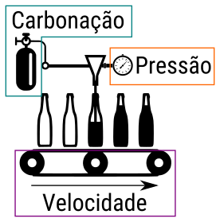

# Experimentos fatoriais completamente cruzados gerais

Em CE 074 · Controle de Processos Industriais serão estudados os
experimentos fatoriais com ênfase nos $2^k$ e $3^k$. Todavia, antes de
partir para esses delineamentos particulares, será visto os experimentos
fatoriais gerais. Nestes estuda-se $k \geq 2$ fatores simultâneamente,
cada um com $n_i$ níveis ($i = 1, \ldots, k)$ com todas as combinações
entre níveis presentes no experimento.

O presente capítulo irá apresentar a análise do experimento fatorial
duplo ($k = 2$) com fatores qualitativos.

```{r, message = FALSE}
# Carrega pacotes.
library(emmeans)
library(tidyverse)
```

## Fatorial duplo · Bateria

Os dados usados nesta seção referem-se àqueles disponíveis em
@montgomery2008design. O experimento foi feito por um engenheiro que
estava projetando uma bateria para um dispositivo que estaria sujeito à
variações extremas de temperatura. Visando projetar uma bateria com
prolongado tempo de vida, o experimentador escolheu 3 materiais para
confecção das baterias e nos testes, submeteu as baterias à 3 níveis de
temperatura para mensurar o tempo de vida, em horas. Cada ponto
experimental teve 4 repetições. As 36 unidades experimentais foram
avaliadas em ordem aleatória.

  * Página da editora sobre o livro: <https://www.wiley.com/en-us/Design+and+Analysis+of+Experiments%2C+10th+Edition-p-9781119492443>.
  * Material suplementar: <http://bcs.wiley.com/he-bcs/Books?action=index&itemId=1119492440&bcsId=11447>.

Na seção a seguir é feita a análise exploratória dos dados.

### Análise exploratória

```{r}
# Tempo de duração da bateria. Tabela 5.1 em Montgomery (2008).
tv <- c(130, 74, 150, 159, 138, 168, 155, 180, 188, 126, 110, 160, 34,
        80, 136, 106, 174, 150, 40, 75, 122, 115, 120, 139, 20, 82, 25,
        58, 96, 82, 70, 58, 70, 45, 104, 60)
temp <- rep(c(15, 70, 125), each = 12)
mate <- rep(rep(c(1:3), each = 2), times = 6)

# Cria tabela com os dados.
tb <- data.frame(temp = factor(temp),
                 mate = factor(mate),
                 tv = tv)

# Remove vetores do espaço de memória.
rm(tv, temp, mate)

# Número de repetições dos pontos experimentais.
xtabs(~mate + temp, data = tb)

ggplot(data = tb,
       mapping = aes(x = temp, color = mate, y = tv)) +
    geom_point() +
    stat_summary(aes(group = mate), geom = "line", fun.y = "mean") +
    labs(x = "Temperatura (°C)",
         y = "Tempo de vida (h)",
         color = "Material")

ggplot(data = tb,
       mapping = aes(x = mate, color = temp, y = tv)) +
    geom_point() +
    stat_summary(aes(group = temp), geom = "line", fun.y = "mean") +
    labs(x = "Material",
         y = "Tempo de vida (h)",
         color = "Temperatura (°C)")
```

### Especificação e ajuste do modelo

O modelo estatístico para esse experimento, considerando ambos fatores
como qualitativos e conduzido sob o delineamento inteiramente
casualizado, é
$$
  \begin{aligned}
    y_{ijk} &\sim \text{Normal}(\mu_{ij}, \sigma^2) \\
    \mu_{ij} &= \mu + \tau_i + \theta_j + \gamma_{ij}\\
    \sigma^2 &\propto 1
  \end{aligned}
$$
em que $y_{ijk}$ é o valor observado para o ponto experimental do
material $i$ e temperatura $j$ na repetição $k$, $\mu$ é uma constante
inerente à todas as observações, $\tau_i$ são parâmetros para acomodar o
efeito de material, $\theta_j$ são parâmetros para acomodar o efeito de
temperatura e $\gamma_{ij}$ são parâmetros para acomodar a interação
entre material e temperatura.

O código abaixo faz o ajuste do modelo aos dados usando a restrição de
zerar o efeito do primeiro nível do fator. Portanto, a interpretação dos
parâmetros está vinculada a essas restrições.

```{r, fig.height = 6}
# Espeficicação do modelo para a função `lm()`.
m0 <- lm(tv ~ mate + temp + mate:temp, data = tb)
m0 <- lm(tv ~ mate * temp, data = tb) # Forma curta.

# Quadro de resumo do ajuste.
summary(m0)

# Análise gráfica dos pressupostos.
par(mfrow = c(2, 2)); plot(m0); layout(1)
```

Os fragmento de código a seguir reproduz o que é retornado pela `lm()`
com a finalidade de deixar explícitas as contas. As operações matriciais
são feitas *ipsis litteris* as disponíveis nos livros. Por outro lado,
não são a forma mais eficiente de implementar.

```{r}
# Matriz do modelo.
X <- model.matrix(~mate * temp, data = tb)

# Indica o tipo de contraste usado.
attr(X, "contrasts")

# Vetor de observações.
y <- cbind(tb$tv)

# Estimativas dos parâmetros.
# coef(m0)
betas <- solve(t(X) %*% X, t(X) %*% y)
betas

# Variância residual.
# deviance(m0)/df.residual(m0)
var_y <- crossprod(y - X %*% betas)/(nrow(X) - ncol(X))

# Matriz de covariância das estimativas.
# vcov(m0)
c(var_y) * solve(t(X) %*% X)
```

Na seção a seguir é obtido o quadro de análise de variância.

### O quadro de análise de variância

O quadro de análise de variância (ANOVA) tem a seguinte composição.

Table: (\#tab:esperanca-quadrados-medios) Esperança dos quadrados médios para o experimento fatorial duplo completo de efeitos fixos.

| FV   | GL               | E(MS)                                                             |
|:-----|:-----------------|:------------------------------------------------------------------|
| A    | $a - 1$          | $\sigma^2 + \frac{br \sum_i \tau_i^2}{a - 1}$                     |
| B    | $b - 1$          | $\sigma^2 + \frac{ar \sum_j \theta_j^2}{b - 1}$                   |
| AB   | $(a - 1)(b - 1)$ | $\sigma^2 + \frac{r \sum_i \sum_j \gamma_{ij}^2}{(a - 1)(b - 1)}$ |
| Erro | $ab(r - 1)$      | $\sigma^2$                                                        |

<https://www.jstor.org/stable/2528712?seq=15#metadata_info_tab_contents>.

O quadro de ANOVA pode ser escrito em termos de matriz

Table: (\#tab:esperanca-somas-de-quadrado) Esperança das somas de
quadrados para o experimento fatorial duplo completo de efeitos
fixos. $\text{tr()}$ é o operador traço e $.$ deve ser substituido pela
matriz de projeção indicada na segunda coluna.

| FV   | Matriz de projeção                 | GL             | E(SQ)                                                 | E(MS)                                                          |
|:-----|:-----------------------------------|:---------------|:------------------------------------------------------|:---------------------------------------------------------------|
|      |                                    | $\text{tr}(.)$ | $\text{tr}(.)\sigma^2 + \beta^\top X^\top (.) X\beta$ | $\sigma^2 + \frac{\beta^\top X^\top (.) X\beta}{\text{tr}(.)}$ |
| A    | $H_{\mu:\tau} - H_{\mu}$           |                |                                                       |                                                                |
| B    | $H_{\mu:\theta} - H_{\mu:\tau}$    |                |                                                       |                                                                |
| AB   | $H_{\mu:\gamma} - H_{\mu:\theta}$  |                |                                                       |                                                                |
| Erro | $I - H_{\mu:\gamma}$               |                |                                                       | $\sigma^2$                                                     |
                                              |

```{r}
# Quadro de análise de variância.
anova(m0)
```

Por meio de expressões com somas de quadrados, que foram aprendidas e
constantemente usadas em CE 213 · Planejamento de Experimentos I,
pode-se obter o quadro de análise de variância para experimentos como
este que é balanceado e de efeitos ortogonais.

As expressões relevantes são
$$
  \begin{align*}
    C &= \frac{y_{...}^2}{abr}\\
    SS_\text{Total} &= \sum_{i} \sum_{j} \sum_{k} y_{ijk}^2 - C\\
    SS_A &= \frac{1}{br} \sum_i y_{i..}^2 - C\\
    SS_B &= \frac{1}{ar} \sum_j y_{.j.}^2 - C\\
    SS_{A\cap B} &= \frac{1}{r} \sum_i \sum_j y_{ij.}^2 - C\\
    SS_{AB} &= SS_{A\cap B} - SS_A - SS_B\\
    SS_{\text{Erro}} &= SS_\text{Total} - SS_{AB} - SS_B - SS_A.
  \end{align*}
$$

A notação de ponto no subíndice indica total sob todas as observações,
ou seja, $y_{i..} = \sum_j \sum_k y_{ijk}$.

```{r}
# Média dos totais ao quadrado.
squared_mean <- function(y) sum(y)^2/length(y)

# Resultados das somas de quadrados.
C <- aggregate(tv ~ 1, data = tb, squared_mean)$tv
SS_A <- sum(aggregate(tv ~ mate, data = tb, squared_mean)$tv) - C
SS_B <- sum(aggregate(tv ~ temp, data = tb, squared_mean)$tv) - C
SS_AiB <- sum(aggregate(tv ~ mate:temp, data = tb, squared_mean)$tv) - C
SS_AB <- SS_AiB - SS_A - SS_B
SS_Total <- sum(y^2) - C
SS_Erro <- SS_Total - SS_A - SS_B - SS_AB

# Somas de quadrados.
rbind(SS_A, SS_B, SS_AB, SS_Erro)
```

Apesar das expressões baseadas em somas de quadrados serem muito úteis,
elas não são apropriadas para experimentos nos quais não se tem
ortogonalidade entre os efeitos, o que pode acontecer por perda de
combinações experimentais, perda unidades experimentais, inclusão de
covariáveis de níveis não controlados e uso de confundimento, por
exemplo. Para lidar com essas situações pode-se obter as somas de
quadrados com operações matriciais baseadas em matrizes de projeção.

Na realidade, as expressões com somas de quadrados são de fato a
simplificação algébrica das equivalentes expressões matriciais.

A vantagem é que com o uso das matrizes de projeção é possível
contemplar a interpretação geométrica do método de mínimos quadrados,
além de permitir acomodar experimentos de estrutura irregular.

As somas de quadrados são o comprimento do vetor resultante da projeção
do vetor das observações em um subespaço linear definido pelas colunas
da matriz do modelo. A matriz de projeção é obtida por meio da matriz de
delineamento ou matriz do modelo
$$
  H = X (X^\top X)^{-1} X^\top.
$$

Considere que a matriz do modelo foi particinada criando uma sequência
de matrizes em que a seguinte tem o conjunto de colunas que acomoda um
termo não contido na precedente. Colocando de outra forma, essa
sequência de matrizes corresponde aos modelos
$$
\begin{aligned}
\mu_{ij} = \mu \quad \Rightarrow &\quad X_{\mu} \\
\mu_{ij} = \mu + \tau_i \quad \Rightarrow &\quad X_{\mu:\tau} \\
\mu_{ij} = \mu + \tau_i + \theta_j \quad \Rightarrow &\quad X_{\mu:\theta} \\
\mu_{ij} = \mu + \tau_i + \theta_j + \gamma_{ij} \quad \Rightarrow &\quad X_{\mu:\gamma},
\end{aligned}
$$
portanto, o operador $:$ no subíndice indica o intervalo de parâmetros
cujas colunas estão na matriz.

Será útil para demonstrações as matrizes correspondentes aos modelos
\begin{aligned}
\mu_{ij} = \mu + \tau_i \quad \Rightarrow &\quad X_{\mu,\tau} \\
\mu_{ij} = \mu + \theta_j \quad \Rightarrow &\quad X_{\mu,\theta} \\
\mu_{ij} = \mu + \gamma_{ij} \quad \Rightarrow &\quad X_{\mu,\gamma}.
\end{aligned}

Formas quadráticas usando as matrizes de projeção retornam as somas de
quadrados. O grau de liberdade corresponde ao traço da matriz usada para
obter as somas de quadrados. As matrizes de projeção, mantendo a sequência de modelos, são
$$
\begin{aligned}
H_{\mu} &= X_{\mu} (X_{\mu}^\top X_{\mu})^{-1} X_{\mu}^\top\\
H_{\mu:\tau} &= X_{\mu:\tau} (X_{\mu:\tau}^\top X_{\mu:\tau})^{-1} X_{\mu:\tau}^\top\\
H_{\mu:\theta} &= X_{\mu:\theta} (X_{\mu:\theta}^\top X_{\mu:\theta})^{-1} X_{\mu:\theta}^\top\\
H_{\mu:\gamma} &= X_{\mu:\gamma} (X_{\mu:\gamma}^\top X_{\mu:\gamma})^{-1} X_{\mu:\gamma}^\top.
\end{aligned}
$$

Dessa forma, as somas de quadrados são obtidas por
$$
\begin{aligned}
C &= y^\top H_{\mu} y\\
SS_A &= y^\top (H_{\mu:\tau} - H_{\mu}) y  = y^\top (H_{\mu:\tau}) y - y^\top (H_{\mu}) y\\
SS_B &= y^\top (H_{\mu:\theta} - H_{\mu:\tau}) y \\
     &= y^\top (H_{\mu,\theta} - H_{\mu}) y \quad \text{ pois }\quad (H_{\mu,\theta} - H_{\mu}) \perp (H_{\mu,\tau} - H_{\mu})\\
SS_{AB} &= y^\top (H_{\mu:\gamma} - H_{\mu:\theta}) y \\
        &= y^\top (H_{\mu,\gamma} - H_{\mu}) y \quad \text{ pois }\quad (H_{\mu,\gamma} - H_{\mu}) \perp (H_{\mu,\theta} - H_{\mu})\\
SS_{\text{Erro}} &= y^\top (I - H_{\mu:\gamma}) y. \\
\end{aligned}
$$

O código a seguir calcula as somas de quadrados conforme indicado pelas
expressões acima.

```{r}
X <- model.matrix(~mate * temp,
                  data = tb,
                  contrasts.arg = list(mate = contr.sum,
                                       temp = contr.sum))

proj <- function(X) {
    X %*% solve(crossprod(X), t(X))
}

a <- attr(X, "assign")
a

I <- diag(length(y))
H0  <- proj(X[, a <= 0])
H01 <- proj(X[, a <= 1])
H02 <- proj(X[, a <= 2])
H03 <- proj(X[, a <= 3])

# Somas de quadrados sequênciais.
t(y) %*% (H0)        %*% y # C:       RSS(~1) - RSS(~0).
t(y) %*% (H01 - H0)  %*% y # SS_A:    RSS(~A) - RSS(~1).
t(y) %*% (H02 - H01) %*% y # SS_B:    RSS(~A + B) - RSS(~A).
t(y) %*% (H03 - H02) %*% y # SS_AB:   RSS(~A * B) - RSS(~A + B).
t(y) %*% (I   - H03) %*% y # SS_Erro.

anova(m0)

# Como os efeitos são ortogonais, sequêncial e um termo por vez dá
# igual.
H1 <- proj(X[, a %in% c(0, 1)])
H2 <- proj(X[, a %in% c(0, 2)])
H3 <- proj(X[, a %in% c(0, 3)])

# Somas de quadrados de um termo de cada vez.
# ATTENTION: Para funcionar tem que usar restrições lineares ortogonais,
# i.e. `contr.sum`, `contr.helmert` ou `contr.poly`.
t(y) %*% (H1 - H0) %*% y # SS_A:  RSS(~A) - RSS(~1).
t(y) %*% (H2 - H0) %*% y # SS_B:  RSS(~B) - RSS(~1).
t(y) %*% (H3 - H0) %*% y # SS_AB: RSS(~A:B) - RSS(~1).

# Mostra que as projeções são ortogonais.
all(round((H1 - H0) %*% (H2 - H0), digits = 4) == 0)

trace <- function(H) {
    sum(diag(H))
}

# Graus de liberdade.
trace(H0)
trace(H01 - H0)
trace(H02 - H01)
trace(H03 - H02)
trace(I   - H03)
```

### Estudo da interação

Quando ocorre interação é porque a predição (média) não é função apenas
dos efeitos principais dos fatores. Colocando de outra forma, a
interação dupla entre os fatores material e temperatura indica que a
diferência em tempo médio de vida da bateria entre dois níveis de
temperatura depende do nível de material. O oposto também é verdadeiro,
as diferenças entre material mudam com o nível de temperatura.

O fragmento abaixo usa o pacote `emmeans` (*estimated marginal means*)
para obter as médias de duração de bateria para cada ponto experimental.

```{r}
# Médias marginais ajustadas = valores preditos para cada ponto
# experimental.
emm <- emmeans(m0, specs = ~temp | mate)
emm

attr(emm, "grid")
unname(attr(emm, "linfct"))

# Constrastes entre níveis de temperatura para cada nível de material.
contrast(emm, method = "pairwise")
```

No fragmento a seguir são obtidas as médias ajustadas, o seu erro
padrão, o contraste entre duas médias e o erro padrão.

```{r}
# Estimativas das médias ajustadas.
Xu <- unique(model.matrix(m0))
Xu %*% coef(m0)

# Erro padrão das médias.
sqrt(diag(Xu %*% vcov(m0) %*% t(Xu)))

# O erro padrão é \sqrt{\hat{\sigma}^2/r}.
sqrt((deviance(m0)/df.residual(m0))/4)

grid <- unique(m0$model[, all.vars(m0$terms)[-1]])
cbind(grid, "." = "|", unname(Xu))

# Contraste `temp@15 - temp@70 | mate@1`.
K <- Xu[1,, drop = FALSE] - Xu[4,, drop = FALSE]

K %*% coef(m0)                      # Estimativa.
sqrt(diag(K %*% vcov(m0) %*% t(K))) # Erro padrão.
```


```{r}
tbm <- as.data.frame(emm)
tbm

gg1 <-
ggplot(tbm, aes(x = temp, y = emmean)) +
    facet_wrap(facets = ~mate) +
    geom_point() +
    geom_errorbar(aes(ymin = lower.CL, ymax = upper.CL),
                  width = 0.05) +
    labs(x = "Temperatura (°C)",
         y = "Tempo de vida (h)")

gg2 <-
ggplot(tbm, aes(x = mate, y = emmean)) +
    facet_wrap(facets = ~temp) +
    geom_point() +
    geom_errorbar(aes(ymin = lower.CL, ymax = upper.CL),
                  width = 0.05) +
    labs(x = "Material",
         y = "Tempo de vida (h)")

gridExtra::grid.arrange(gg1, gg2, ncol = 1)
```

## Fatorial duplo · Soja

Os dados analisados nessa sessão também são de experimento fatorial
duplo, no caso um 3 $\times$ 5 instalado no delineamento de blocos
casualizados completos com 5 repetições. Estes dados foram usados no
artigo [SERAFIM, Milson Evaldo et al. Umidade do solo e doses de
potássio na cultura da soja. Rev. Ciênc. Agron., Fortaleza, v. 43, n. 2,
p. 222-227, June
2012.](http://www.scielo.br/scielo.php?script=sci_arttext&pid=S1806-66902012000200003).

### Análise exploratória

A análise exploratória TODO

```{r, include = FALSE}
soja <-
structure(list(potassio = c(0L, 30L, 60L, 120L, 180L, 0L, 30L,
60L, 120L, 180L, 0L, 30L, 60L, 120L, 180L, 0L, 30L, 60L, 120L,
180L, 0L, 30L, 60L, 120L, 180L, 0L, 30L, 60L, 120L, 180L, 0L,
30L, 60L, 120L, 180L, 0L, 30L, 60L, 120L, 180L, 0L, 30L, 60L,
120L, 180L, 0L, 30L, 60L, 120L, 180L, 0L, 30L, 60L, 120L, 180L,
0L, 30L, 60L, 120L, 180L, 0L, 30L, 60L, 120L, 180L, 0L, 30L,
60L, 120L, 180L, 0L, 30L, 60L, 120L, 180L), agua = c(37.5, 37.5,
37.5, 37.5, 37.5, 50, 50, 50, 50, 50, 62.5, 62.5, 62.5, 62.5,
62.5, 37.5, 37.5, 37.5, 37.5, 37.5, 50, 50, 50, 50, 50, 62.5,
62.5, 62.5, 62.5, 62.5, 37.5, 37.5, 37.5, 37.5, 37.5, 50, 50,
50, 50, 50, 62.5, 62.5, 62.5, 62.5, 62.5, 37.5, 37.5, 37.5, 37.5,
37.5, 50, 50, 50, 50, 50, 62.5, 62.5, 62.5, 62.5, 62.5, 37.5,
37.5, 37.5, 37.5, 37.5, 50, 50, 50, 50, 50, 62.5, 62.5, 62.5,
62.5, 62.5), bloco = structure(c(1L, 1L, 1L, 1L, 1L, 1L, 1L,
1L, 1L, 1L, 1L, 1L, 1L, 1L, 1L, 2L, 2L, 2L, 2L, 2L, 2L, 2L, 2L,
2L, 2L, 2L, 2L, 2L, 2L, 2L, 3L, 3L, 3L, 3L, 3L, 3L, 3L, 3L, 3L,
3L, 3L, 3L, 3L, 3L, 3L, 4L, 4L, 4L, 4L, 4L, 4L, 4L, 4L, 4L, 4L,
4L, 4L, 4L, 4L, 4L, 5L, 5L, 5L, 5L, 5L, 5L, 5L, 5L, 5L, 5L, 5L,
5L, 5L, 5L, 5L), .Label = c("I", "II", "III", "IV", "V"), class = "factor"),
    rengrao = c(14.55, 21.51, 24.62, 21.88, 28.11, 17.16, 24.44,
    28.5, 32.94, 28.76, 14.13, 19.71, 31.05, 38.35, 36.97, 15.72,
    19.72, 24.29, 25.39, 28.45, 15.44, 28.12, 31.49, 29.95, 30.06,
    15.42, 23.68, 33.27, 36.63, 41.04, 12.77, 20.45, 24.35, 27.15,
    24.08, 16.01, 24.57, 28.85, 26.23, 26.36, 16.08, 20.99, 30.45,
    36.83, 34.6, 14.26, 23.71, 22.76, 22.46, 22.97, 15.54, 18.48,
    25.54, 30.29, 30.64, 17.26, 20.51, 24.47, 34.52, 37.62, 10.3,
    16.28, 23.61, 29.66, 23.34, 14.41, 17.24, 29.08, 29.52, 27.98,
    17.56, 20.05, 29.9, 20.86, 35.5), pesograo = c(10.7, 13.53,
    15.78, 12.8, 14.79, 12.26, 12.66, 14.25, 15.84, 12.45, 10.7,
    11.07, 13.44, 14.15, 14.11, 13.1, 13.51, 15.28, 16.7, 17.89,
    12.45, 11.77, 12.7, 15.76, 12.53, 11.01, 14.18, 14.04, 15.26,
    16.55, 12.05, 13.03, 11.94, 16.07, 16.38, 12.04, 12.35, 13.67,
    11.76, 10.1, 12.56, 12.86, 14.1, 17.13, 15.18, 11.41, 12.82,
    14.31, 12.76, 14.92, 11.68, 12.4, 15.02, 14.09, 16.47, 11.74,
    13.32, 13.67, 15.07, 17.42, 11.2, 12.24, 16.99, 17.87, 18.23,
    11, 11.49, 13.34, 12.51, 10.72, 11.71, 12.85, 13.91, 16.3,
    17.07), kgrao = c(15.13, 17.12, 19.11, 18.12, 19.11, 12.14,
    13.63, 17.12, 19.11, 21.1, 13.14, 17.62, 15.13, 18.12, 20.11,
    13.14, 17.62, 17.62, 20.61, 21.1, 14.13, 14.63, 19.11, 21.1,
    21.1, 13.14, 14.13, 23.1, 18.61, 19.61, 15.13, 16.62, 18.61,
    20.11, 20.61, 13.63, 16.12, 20.61, 18.61, 21.6, 14.13, 16.62,
    17.62, 15.13, 21.1, 14.13, 14.63, 13.14, 22.1, 22.1, 12.64,
    20.11, 19.11, 17.62, 21.1, 12.64, 15.63, 17.12, 21.1, 22.6,
    17.62, 19.11, 20.11, 17.12, 21.6, 13.63, 20.61, 19.11, 18.61,
    21.1, 10.65, 18.61, 18.61, 20.11, 21.1), pgrao = c(1.18,
    0.99, 0.82, 0.85, 0.88, 1.05, 1.08, 0.74, 1.01, 1.01, 1.18,
    1.18, 1.08, 1.05, 1.14, 1.08, 1.05, 0.79, 0.87, 0.99, 0.98,
    1.16, 0.95, 1.14, 1.05, 1.18, 1.08, 1.18, 1.11, 1.14, 1.25,
    1.01, 0.93, 0.85, 1, 1.21, 1, 0.85, 0.99, 0.91, 1.18, 1.21,
    1.14, 1.11, 1.18, 1.14, 1.01, 1.25, 0.85, 1.05, 1.04, 0.85,
    0.75, 1.03, 1.14, 1.21, 1.28, 1.25, 1.14, 1.14, 1.28, 1.18,
    0.95, 0.85, 1.08, 0.93, 1.25, 0.9, 0.99, 0.93, 1.18, 1.28,
    1.25, 1.13, 1.15), ts = c(136L, 159L, 156L, 171L, 190L, 140L,
    193L, 200L, 208L, 237L, 132L, 178L, 231L, 271L, 262L, 120L,
    146L, 159L, 152L, 159L, 124L, 239L, 248L, 190L, 240L, 140L,
    167L, 237L, 240L, 248L, 106L, 157L, 204L, 169L, 147L, 133L,
    199L, 211L, 223L, 261L, 128L, 164L, 216L, 215L, 228L, 125L,
    185L, 159L, 176L, 154L, 133L, 149L, 170L, 215L, 186L, 147L,
    154L, 179L, 229L, 216L, 92L, 133L, 139L, 166L, 128L, 131L,
    150L, 218L, 236L, 261L, 150L, 156L, 215L, 128L, 208L), nvi = c(22L,
    2L, 0L, 2L, 0L, 20L, 6L, 6L, 7L, 10L, 23L, 10L, 5L, 0L, 1L,
    22L, 0L, 1L, 0L, 0L, 12L, 9L, 4L, 1L, 4L, 14L, 7L, 3L, 1L,
    0L, 4L, 3L, 1L, 0L, 1L, 22L, 7L, 3L, 7L, 5L, 21L, 9L, 3L,
    2L, 2L, 11L, 7L, 1L, 2L, 1L, 27L, 4L, 1L, 2L, 4L, 18L, 10L,
    2L, 0L, 1L, 5L, 5L, 2L, 0L, 1L, 26L, 1L, 4L, 1L, 4L, 17L,
    13L, 3L, 0L, 2L), nv = c(56L, 62L, 66L, 68L, 82L, 63L, 86L,
    94L, 86L, 97L, 58L, 80L, 99L, 110L, 106L, 48L, 64L, 62L,
    60L, 62L, 52L, 103L, 103L, 87L, 101L, 64L, 77L, 96L, 94L,
    105L, 44L, 63L, 84L, 66L, 58L, 56L, 81L, 92L, 91L, 100L,
    50L, 71L, 94L, 89L, 89L, 60L, 75L, 67L, 76L, 63L, 51L, 60L,
    67L, 90L, 80L, 62L, 67L, 75L, 90L, 87L, 36L, 57L, 53L, 69L,
    50L, 57L, 61L, 92L, 96L, 110L, 69L, 63L, 95L, 55L, 90L)), class = "data.frame", row.names = c(NA,
-75L))
```

```{r, eval = FALSE}
# Importação do arquivo da web.
url <- "http://leg.ufpr.br/~walmes/data/soja.txt"
soja <- read.table(url, header = TRUE, sep = "\t", dec = ",")
```

```{r}
# Estrutura do objeto.
str(soja)

# Repetições de cada ponto experimental.
xtabs(~agua + potassio, data = soja)

# Análise exploratória.
gg1 <-
ggplot(data = soja,
       mapping = aes(x = potassio,
                     y = rengrao,
                     color = factor(agua))) +
    geom_point() +
    stat_summary(mapping = aes(group = agua),
                 geom = "line",
                 fun.y = "mean")
gg2 <-
ggplot(data = soja,
       mapping = aes(x = agua,
                     y = rengrao,
                     color = factor(potassio))) +
    geom_point() +
    stat_summary(mapping = aes(group = potassio),
                 geom = "line",
                 fun.y = "mean")

gridExtra::grid.arrange(gg1, gg2, ncol = 1)
```

A análise exploratória indica que uma observação do ponto experimental
`agua = 62.5 & potassio = 120` tem um valor baixo considerando o
contexto. Na realidade, foi uma parcela comprometida durante o manuseio
ficando apenas com uma ao invés de duas plantas no vaso. As variáveis
`rengrao`, `ts`, `nv` e `nvi` foram então afetadas por isso. Existem 3
alternativas:

  1. Multiplar o valor observado na parcela por 2 para as variáveis
     resposta indicadas (extrapolação).
  2. Remover essa parcela da análise para as variáveis resposta
     indicadas (perda de informação parcial).
  3. Conduzir uma análise de variância ponderada para as variáveis
     resposta indicadas, usando o peso 2 para todas as unidades
     experimentais com 2 plantas e 1 para esta com uma planta
     (ponderação).

Dentre as alternativas, a 3 é a mais apropriada e tão fácil de
implementar quanto as anteriores. Basta que seja criado o vetor de pesos
e usado na especificação do modelo para a função `lm()` por meio do
parâmetro `weigths`.

```{r}
soja %>%
    filter(agua == 62.5 & potassio == 120) %>%
    select(rengrao, ts, nvi, nv)

i <- with(soja, agua == 62.5 & potassio == 120 & bloco == "V")
which(i)

soja$n <- 2
soja$n[i] <- 1
```

Para conduzir essa análise, será considerado nessa ocasião que ambos os
fatores são qualitativos. Dessa forma, o modelo será um modelo de médias
de pontos experimentais. Depois será indicado o correspondente modelo
para o das variáveis entrarem como fatores quantitativos.

```{r}
# Cria cópia dos fatores como qualitativos.
soja <- transform(soja,
                  Agua = factor(agua),
                  Potassio = factor(potassio))
```

### Especificação e ajuste do modelo

```{r}
# Ajuste do modelo aos dados.
m0 <- lm(rengrao ~ bloco + Agua * Potassio,
         data = soja)

# Diagnóstico do modelo sem ponderação.
par(mfrow = c(2, 2))
plot(m0)
layout(1)

# A variável resposta é a média amostral dentro da unidade experimental.
m1 <- lm(rengrao/n ~ bloco + Agua * Potassio,
         data = soja,
         weights = n)

# Diagnóstico do modelo com ponderação.
par(mfrow = c(2, 2))
plot(m1)
layout(1)
```

### O quadro de análise de variância

O quadro de análise de variância aparece a seguir. As contas para
obtenção do quadro de ANOVA já foram apresentadas. No entanto, para
acomodar os pesos não serão apresentadas as expressões de somatório. Os
pesos entram na solução de mínimos quadrados da seguinte forma
$$
  \hat{\beta} = (X^\top W X)^{-1} (X^\top W y),
$$
em que $W$ é uma matriz diagonal contendo os tamanhos amostrais
associados ao vetor $y$ que é de médias amostrais dentro de cada unidade
experimental.

```{r}
# Quadro de análise de variância.
anova(m1)
```

O quadro de análise de variância indica que existe interação entre água
e potássio. Nesse ponto poderia-se ir para o estudo da interação por
meio de comparações múltiplas. No entanto, pode se estudar a interação
com um pouco de mais detalhes no próprio quadro de análise de variância
por meio de testes de hipótese do efeito de um fator dentro dos níveis
dos demais fatores. Essa hipótese é testada pelo teste F do quadro de
análise de variância.

Para decompor as somas de quadrados, especificamos um modelo de efeito
aninhados. Em termos de número de parâmetros, o modelo de efeito
aninhados tem a mesma quantidade do modelo de efeito cruzados. O que
muda é a parametrização e é a partir desta que as hipóteses de efeito de
um fator dentro de níveis dos outros é testada. Abaixo estão as
expressões dos modelos cruzados e aninhados.

$$
\begin{aligned}
\text{E}(y_{ij}) &= \mu +
   \underset{a - 1}{\tau_i} +
   \underset{b - 1}{\theta_j} +
   \underset{(a  - 1)(b - 1)}{\gamma_{ij}}\\
                 &= \mu +
   \underset{a - 1}{\tau_i} +
   \underset{a(b - 1)}{\delta_{i(j)}}
\end{aligned}
$$

Nessas expressões, os números abaixo dos parâmetros correspondem a
quantidade de parâmetros em cada termo, em que $a$ e $b$ são o número de
níveis e cada fator. A quantidade de parâmetros é a mesma pois
$$
  (b - 1) + (a - 1)(b - 1) = a(b - 1).
$$

A seguir declara-se o modelo de efeitos aninhados de potássio dentro de
água e depois de água dentro de potássio. O teste de hipótese é feito a
partição das somas de quadrados do quadro de análise de variância. Para
a partição é preciso indicar a posição dos parâmetros que estarão sob
teste, ou seja, envolvidos na hipótese nula
$$
H_{0i}:
  \begin{bmatrix}
    \delta_{i(1)}\\
    \vdots\\
    \delta_{i(b-1)} \\
  \end{bmatrix} =
  \begin{bmatrix}
    0 \\
    \vdots \\
    0
  \end{bmatrix},
  i = 1, \ldots, a.
$$

O código deixa bastante deduzível como isso é informado e como
interpretar o resultado.

```{r}
# Modelo de efeitos aninhados.
m2 <- aov(pesograo/n ~ bloco + Agua/Potassio,
          data = soja,
          weights = n)
coef(m2)

# Disposição das estimativas dos parâmetros.
names(coef(m2)[m2$assign == 3])

# Para testar o efeito de potássio em cada nível de água.
Pot_in_Ag <- list("Pot@37.5" = c(1, 4, 7, 10),
                  "Pot@50.0" = c(2, 5, 8, 11),
                  "Pot@62.5" = c(3, 6, 9, 12))
summary(m2, split = list("Agua:Potassio" = Pot_in_Ag))

# Modelo de efeitos aninhados.
m2 <- aov(pesograo/n ~ bloco + Potassio/Agua,
          data = soja,
          weights = n)
coef(m2)

# Disposição das estimativas dos parâmetros.
names(coef(m2)[m2$assign == 3])

# Para testar o efeito de água em cada nível de potássio.
Ag_in_Pot <- list("Agua@0" = c(1, 6),
                  "Agua@30" = c(2, 7),
                  "Agua@60" = c(3, 8),
                  "Agua@120" = c(4, 9),
                  "Agua@180" = c(5,10))
summary(m2, split = list("Potassio:Agua" = Ag_in_Pot))
```

### Estudo da interação

```{r}
emm_pot_ag <- emmeans(m1, specs = ~Potassio | Agua)
emm_pot_ag

contrast(emm_pot_ag, method = "pairwise")

emm_ag_pot <- emmeans(m1, specs = ~Agua | Potassio)
emm_ag_pot

contrast(emm_ag_pot, method = "pairwise")

gg1 <-
ggplot(as.data.frame(emm_pot_ag),
       mapping = aes(x = Potassio, y = emmean, group = 1)) +
    facet_wrap(facets = ~Agua, nrow = 1) +
    geom_point() +
    geom_line() +
    geom_errorbar(aes(ymin = lower.CL, ymax = upper.CL),
                  width = 0.1) +
    labs(x = "Potássio",
         y = "Rendimento de grãos")

gg2 <-
ggplot(as.data.frame(emm_ag_pot),
       mapping = aes(x = Agua, y = emmean, group = 1)) +
    facet_wrap(facets = ~Potassio, nrow = 1) +
    geom_point() +
    geom_line() +
    geom_errorbar(aes(ymin = lower.CL, ymax = upper.CL),
                  width = 0.1) +
    labs(x = "Água",
         y = "Rendimento de grãos")

gridExtra::grid.arrange(gg1, gg2, ncol = 1)
```

Fica evidente pelos resultados que acomodar o efeito, principalmente de
potássio, por uma função numérica dos níveis pode ser mais interessante
que considerar como variável qualitativa. Isso será feito em outros
momentos durante o curso. No entanto, pode-se adiantar que, dado a
trajetória das médias que o acomodar o efeito de potássio por um
polinômio de 3º grau e o efeito de água com um de 2º seja
suficiente. Dessa forma, o modelo seria
$$
\begin{aligned}
\text{E}(y_{ij}) &= \mu \\
 &+ \tau_1 \cdot \text{ag} +
    \tau_2 \cdot \text{ag}^2 \\
 &+ \theta_1 \cdot \text{pt} +
    \theta_2 \cdot \text{pt}^2 +
    \theta_3 \cdot \text{pt}^3\\
 &+ \gamma_{11} \cdot \text{ag}  \cdot\text{pt} +
    \gamma_{21} \cdot \text{ag}^2\cdot\text{pt}\\
 &+ \gamma_{12} \cdot \text{ag}  \cdot\text{pt}^2 +
    \gamma_{22} \cdot \text{ag}^2\cdot\text{pt}^2\\
 &+ \gamma_{13} \cdot \text{ag}  \cdot\text{pt}^3 +
    \gamma_{23} \cdot \text{ag}^2\cdot\text{pt}^3.\\
\end{aligned}
$$

O termo que representa o efeito de blocos foi omitido por simplicidade.

## Fatorial triplo · Desvio de enchimento

Para exemplificar a análise do experimento fatorial triplo, será
considerado os dados em @montgomery2008design. O contexto do experimento
está descrito a seguir.

Um fabricante de refrigerante está interessado em obter volumes de
enchimento mais uniformes nas garrafas produzidas por seu processo de
fabricação. A máquina de envase teoricamente preenche cada garrafa com o
volume alvo correta, mas, na prática, há variação em torno desse alvo, e
o fabricante gostaria de entender melhor as fontes dessa variabilidade
e, eventualmente, reduzi-las. O engenheiro de processo pode controlar
três variáveis ​​durante o processo de enchimento: a porcentagem de
carbonatação (A), a pressão operacional no enchimento (B) e as garrafas
produzidas por minuto ou a velocidade da linha (C). A pressão e a
velocidade são fáceis de controlar, mas a porcentagem de carbonatação é
mais difícil de controlar durante a fabricação real porque varia com a
temperatura do produto. No entanto, para fins de um experimento, o
engenheiro pode controlar a carbonatação em três níveis: 10, 12 e 14 por
cento. Ela escolheu dois níveis de pressão (25 e 30 psi) e dois níveis
de velocidade de linha (200 e 250 bpm). Ele decidiu executar duas
réplicas de um planejamento fatorial nesses três fatores, com todas as
24 tiradas em ordem aleatória. A variável de resposta observada é o
desvio médio da altura de enchimento alvo observada em uma corrida de
produção de garrafas em cada conjunto de condições. Os dados que
resultaram deste experimento são recriados no código abaixo. Desvios
positivos são volumes de preenchimento acima do alvo, enquanto desvios
negativos são volumes de preenchimento abaixo do alvo.

(ref:bottling-line) Ilustração do processo de enchimento das garrafas
indicando os fatores que influenciam o volume de enchimento que estão
sob investigação: carbonação, pressão e velocidade.

```{r, echo = FALSE, out.width = "276px", fig.cap = '(ref:bottling-line)'}

```

### Análise exploratória

Os gráficos a seguir tem a finalidade de

  * Inspecionar a variável resposta em relação a valores atípicos.
  * Antecipar a existência de efeito principal dos fatores.
  * Antecipar a existência de interações entre os fatores.

```{r}
# Recria os dados.
da <- data.frame(carb = rep(rep(c(10, 12, 14), each = 2), times = 4),
                 pres = rep(c(25, 30), each = 12),
                 velo = rep(c(200, 250, 200, 250), each = 6))
da$dsv <- c(-3, -1, 0, 1, 5, 4,
            -1, 0, 2, 1, 7, 6,
            -1, 0, 2, 3, 7, 9,
            1, 1, 6, 5, 10, 11)
str(da)

# Repetições dos pontos experimentais.
ftable(xtabs(~pres + velo + carb, data = da))

ggplot(data = da,
       mapping = aes(x = carb, y = dsv)) +
    facet_grid(facets = pres ~ velo) +
    geom_point() +
    stat_summary(geom = "line", fun.y = "mean") +
    labs(x = "Carbonação (%)", y = "Desvio de enchimento")

ggplot(data = da,
       mapping = aes(x = pres, y = dsv, color = carb)) +
    facet_wrap(facets = ~ velo) +
    geom_point() +
    stat_summary(mapping = aes(group = carb),
                 geom = "line", fun.y = "mean") +
    labs(x = "Pressão", y = "Desvio de enchimento",
         color = "Carbonação (%)")
```

Com base na leitura dos gráficos, conclui-se haver pouca evidência
visual para existência de interações. Por outro lado, espera-se que haja
efeito principal, especialmente para carbonação.

### Especificação e ajuste do modelo

O modelo para o experimento, considerando momentaneamente que todos os
fatores são qualitativos, é
$$
  \begin{aligned}
    y_{ijkl} &\sim \text{Normal}(\mu_{ijk}, \sigma^2) \\
    \mu_{ijk} &= \mu + \alpha_i + \beta_j + \gamma_k +
      \theta_{ij} + \tau_{ik} + \psi_{jk} + \lambda_{ijk}\\
    \sigma^2 &\propto 1,
  \end{aligned}
$$
em que $y_{ijkl}$ é o valor observado para o ponto experimental da
carbonação $i$, pressão $j$, velocidade $k$ na repetição $l$, $\mu$ é
uma constante inerente à todas as observações, $\alpha_i$ são parâmetros
para acomodar o efeito de carbonação, $\beta_j$ são parâmetros para
acomodar o efeito de pressão, $\gamma_k$ são parâmetros para acomodar o
efeito da velocidade. Os demais parâmetros acomodam o efeito de
interações duplas e a interação tripla.

Como as variáveis são todas quantitativas, poderia-se, sem prejuízo
algum, espeficicar um modelo de efeito para níveis quantitativos usando
polinômios. O modelo abaixo é uma alternativa ao anterior que
apresentará a mesma qualidade de ajuste visto que é um modelo linear nos
parâmetros de mesmo tamanho, ou seja, mesma quantidade de parâmetros. O preditor será
$$
  \begin{aligned}
    \mu_{ijk} &= \mu \\
      &+ \alpha_1\cdot\text{carb} + \alpha_2\cdot\text{carb}^2 \\
      &+ \beta_1\cdot\text{pres} \\
      &+ \gamma_1\cdot\text{velo} \\
      &+ \theta_{11}\cdot\text{carb}\cdot\text{pres} +
         \theta_{21}\cdot\text{carb}^2\cdot\text{pres}\\
      &+ \tau_{11}\cdot\text{carb}\cdot\text{velo} +
         \tau_{21}\cdot\text{carb}^2\cdot\text{velo}\\
      &+ \psi_{11}\cdot\text{pres}\cdot\text{velo}\\
      &+ \lambda_{111}\cdot\text{carb}\cdot\text{pres}\cdot\text{velo} +
         \lambda_{211}\cdot\text{carb}^2\cdot\text{pres}\cdot\text{velo}\\
  \end{aligned}
$$
em que todos os fatores são descritos por um termo linear e a carbonação
que possui 3 níveis, tem o termo quadrático. As interações são produtos
dos termos que acomodam os efeitos principais dos três
fatores. Manteve-se as mesmas letras gregas, porém, a interpretação dos
parâmetros agora é em termos de coeficientes de regressão.

```{r, fig.height = 6}
# Cria cópia dos fatores como qualitativos.
da <- transform(da,
                Carb = factor(carb),
                Pres = factor(pres),
                Velo = factor(velo))

# Modelo com interações até 3 grau.
m0 <- lm(dsv ~ Carb * Pres * Velo, data = da)

deviance(m0)
deviance(lm(dsv ~ (carb + I(carb^2)) * pres * velo, data = da))

# Diagnóstico sobre os pressupostos.
par(mfrow = c(2, 2))
plot(m0)
layout(1)

summary(m0)
```

### Quadro de análise de variância

O quadro de análise de variância indica não haver efeito da interação
tripla. Com isso, na análise das interações duplas não aponta existência
de efeito relevante (à 5%).

```{r}
# Quadro de análise de variância.
anova(m0)
```

As expressões de somatório para as somas de quadradas apresentadas na
sessão anterior podem ser adaptadas para o caso de experimento fatorial
triplo. O código abaixo computa as somas de quadrados.

```{r}
# Média dos totais ao quadrado.
squared_mean <- function(y) sum(y)^2/length(y)

# Resultados das somas de quadrados.
C <- aggregate(dsv ~ 1, data = da, squared_mean)$dsv
SS_A <- sum(aggregate(dsv ~ Carb, data = da, squared_mean)$dsv) - C
SS_B <- sum(aggregate(dsv ~ Pres, data = da, squared_mean)$dsv) - C
SS_C <- sum(aggregate(dsv ~ Velo, data = da, squared_mean)$dsv) - C

SS_AiB <- sum(aggregate(dsv ~ Carb:Pres, data = da,
                        squared_mean)$dsv) - C
SS_AB <- SS_AiB - SS_A - SS_B

SS_AiC <- sum(aggregate(dsv ~ Carb:Velo, data = da,
                        squared_mean)$dsv) - C
SS_AC <- SS_AiC - SS_A - SS_C

SS_BiC <- sum(aggregate(dsv ~ Pres:Velo, data = da,
                        squared_mean)$dsv) - C
SS_BC <- SS_BiC - SS_B - SS_C

SS_AiBiC <- sum(aggregate(dsv ~ Carb:Pres:Velo, data = da,
                          squared_mean)$dsv) - C
SS_ABC <- SS_AiBiC - SS_A - SS_B - SS_C - SS_AB - SS_AC - SS_BC

SS_Total <- sum(da$dsv^2) - C
SS_Erro <- SS_Total - SS_AiBiC

# Somas de quadrados.
rbind(SS_A, SS_B, SS_AB,
      SS_AB, SS_AC, SS_BC,
      SS_ABC,
      SS_Erro)
```

### Médias ajustadas

As médias ajustadas são os valores preditos para cada ponto
experimental. Todavia, como não há interação, pode-se obter as médias
marginais ajustadas. Elas são médias para os níveis de um fator
ponderando ou marginalizando o efeito dos demais fatores. Por exemplo,
por meio dos coeficientes estimados do modelo de regressão, a média
marginal ajustada para os níveis de carbonação é
$$
\begin{aligned}
\hat{\mu}_\text{A} &= L_{\text{A}} \hat{\beta} \\
\begin{bmatrix}
  \hat{\mu}_{1..}\\
  \hat{\mu}_{2..}\\
  \hat{\mu}_{3..}\\
\end{bmatrix} &=
\begin{bmatrix}
  1 & 0 & 0 & 1/2 & 1/2 & 0 & 0 & 0 & 0 & 1/4 & 0 & 0 \\
  1 & 1 & 0 & 1/2 & 1/2 & 1/2 & 0 & 1/2 & 0 & 1/4 & 1/4 & 0 \\
  1 & 0 & 1 & 1/2 & 1/2 & 0 & 1/2 & 0 & 1/2 & 1/4 & 0 & 1/4 \\
\end{bmatrix}
\begin{bmatrix}
  \hat{\mu}\\
  \hat{\alpha}_2\\
  \hat{\alpha}_3\\
  \hat{\beta}_2\\
  \hat{\gamma}_2\\
  \hat{\theta}_{22}\\
  \hat{\theta}_{32}\\
  \hat{\tau}_{22}\\
  \hat{\tau}_{32}\\
  \hat{\psi}_{22}\\
  \hat{\lambda}_{222}\\
  \hat{\lambda}_{322}\\
\end{bmatrix}.
\end{aligned}
$$

O pacote `emmeans` permite obter as médias marginais para uma ampla
classe de modelos. O pacote constrói a matriz $L$ conforme uso do
argumento `specs`. A vantagem é que ela considera o tipo de contraste
que foi usado para solucionar o problema de mínimos quadrados.

<!-- .
$$
\begin{aligned}
  \hat{y}_{1..} & = 1\hat{\mu}\\
 &\quad + 0\cdot\hat{\alpha_2} +
          0\cdot\hat{\alpha_3} \\
 &\quad + 0.5\cdot\frac{\hat{\beta}_2}{2} \\
 &\quad + 0.5\cdot\frac{\hat{\gamma}_2}{2} \\
 &\quad + 0\cdot\frac{\hat{\theta}_{22}}{4} +
          0\cdot\frac{\hat{\theta}_{32}}{4}\\
 &\quad + 0\cdot\frac{\hat{\tau}_{22}}{2} +
          0\cdot\frac{\hat{\tau}_{32}}{2}\\
 &\quad + 0.25\cdot\frac{\hat{\psi}_{22}}{2}\\
 &\quad + 0\cdot\frac{\hat{\lambda}_{222}}{2} +
          0\cdot\frac{\hat{\lambda}_{322}}{2}
\end{aligned}
$$

$$
\begin{aligned}
  \hat{y}_{2..} & = 1\hat{\mu}\\
 &\quad + 1\cdot\hat{\alpha_2} +
          0\cdot\hat{\alpha_3} \\
 &\quad + 0.5\cdot\frac{\hat{\beta}_2}{2} \\
 &\quad + 0.5\cdot\frac{\hat{\gamma}_2}{2} \\
 &\quad + 0.5\cdot\frac{\hat{\theta}_{22}}{4} +
          0\cdot\frac{\hat{\theta}_{32}}{4}\\
 &\quad + 0.5\cdot\frac{\hat{\tau}_{22}}{2} +
          0\cdot\frac{\hat{\tau}_{32}}{2}\\
 &\quad + 0.25\cdot\frac{\hat{\psi}_{22}}{2}\\
 &\quad + 0.25\cdot\frac{\hat{\lambda}_{222}}{2} +
          0\cdot\frac{\hat{\lambda}_{322}}{2}\\
\end{aligned}
$$

$$
\begin{aligned}
  \hat{y}_{3..} & = 1\hat{\mu}\\
 &\quad + 0\cdot\hat{\alpha_2} +
          1\cdot\hat{\alpha_3} \\
 &\quad + 0.5\cdot\frac{\hat{\beta}_2}{2} \\
 &\quad + 0.5\cdot\frac{\hat{\gamma}_2}{2} \\
 &\quad + 0\cdot\frac{\hat{\theta}_{22}}{4} +
          0.5\cdot\frac{\hat{\theta}_{32}}{4}\\
 &\quad + 0\cdot\frac{\hat{\tau}_{22}}{2} +
          0.5\cdot\frac{\hat{\tau}_{32}}{2}\\
 &\quad + 0.25\cdot\frac{\hat{\psi}_{22}}{2}\\
 &\quad + 0\cdot\frac{\hat{\lambda}_{222}}{2} +
          0.25\cdot\frac{\hat{\lambda}_{322}}{2}\\
\end{aligned}
$$
-->

```{r}
# Médias marginais ajustas para o efeito principal de carbonação.
emm <- emmeans(m0, specs = ~Carb)
emm

MASS::fractions(attr(emm, "linfct"))
attr(emm, "linfct") %*% coef(m0)

contrast(emm, method = "pairwise")
```
```{r, eval = FALSE, include = FALSE}
library(xtable)
u <- MASS::fractions(attr(emm, "linfct"))
print.xtable(xtable(as.character(u)),
             only.contents = TRUE,
             include.rownames = FALSE)
```

As médias marginais para o efeito de pressão são obtidas com a seguinte
função linear das estimativas dos parâmetros
$$
\begin{aligned}
\hat{\mu}_\text{B} &= L_{\text{B}} \hat{\beta} \\
\begin{bmatrix}
  \hat{\mu}_{.1.}\\
  \hat{\mu}_{.2.}\\
\end{bmatrix} &=
\begin{bmatrix}
  1 & 1/3 & 1/3 & 0 & 1/2 & 0 & 0 & 1/6 & 1/6 & 0 & 0 & 0 \\
  1 & 1/3 & 1/3 & 1 & 1/2 & 1/3 & 1/3 & 1/6 & 1/6 & 1/2 & 1/6 & 1/6 \\
\end{bmatrix}
\begin{bmatrix}
  \hat{\mu}\\
  \hat{\alpha}_2\\
  \hat{\alpha}_3\\
  \hat{\beta}_2\\
  \hat{\gamma}_2\\
  \hat{\theta}_{22}\\
  \hat{\theta}_{32}\\
  \hat{\tau}_{22}\\
  \hat{\tau}_{32}\\
  \hat{\psi}_{22}\\
  \hat{\lambda}_{222}\\
  \hat{\lambda}_{322}\\
\end{bmatrix}.
\end{aligned}
$$

Esteja ciente de que a matriz $L_{B}$ que prémultiplica os parâmetros
estimados está vínculada ao tipo de restrição paramétrica
considerada. Nesta análise foi usado o contraste de tratamento
(`contr.treatment`) que é o padrão do R. Se for usada outra restrição
paramétrica, a matriz $L_{*}$ será diferente mas as médias marginais
ainda serão as mesmas porque elas são invariantes à parametrização
adotada. A função `emmeans()` já considera o tipo de contraste na hora
de construir a matriz de funções lineares.

```{r}
# Médias marginais ajustas para o efeito principal de pressão.
emm <- emmeans(m0, specs = ~Pres)
emm

contrast(emm, method = "pairwise")
```
```{r, eval = FALSE, include = FALSE}
library(xtable)
u <- MASS::fractions(attr(emm, "linfct"))
print.xtable(xtable(as.character(u)),
             only.contents = TRUE,
             include.rownames = FALSE)
```

As médias marginais para o efeito de velocidade são obtidas com a
seguinte função linear das estimativas dos parâmetros
$$
\begin{aligned}
\hat{\mu}_\text{C} &= L_{\text{C}} \hat{\beta} \\
\begin{bmatrix}
  \hat{\mu}_{..1}\\
  \hat{\mu}_{..2}\\
\end{bmatrix} &=
\begin{bmatrix}
  1 & 1/3 & 1/3 & 1/2 & 0 & 1/6 & 1/6 & 0 & 0 & 0 & 0 & 0 \\
  1 & 1/3 & 1/3 & 1/2 & 1 & 1/6 & 1/6 & 1/3 & 1/3 & 1/2 & 1/6 & 1/6 \\
\end{bmatrix}
\begin{bmatrix}
  \hat{\mu}\\
  \hat{\alpha}_2\\
  \hat{\alpha}_3\\
  \hat{\beta}_2\\
  \hat{\gamma}_2\\
  \hat{\theta}_{22}\\
  \hat{\theta}_{32}\\
  \hat{\tau}_{22}\\
  \hat{\tau}_{32}\\
  \hat{\psi}_{22}\\
  \hat{\lambda}_{222}\\
  \hat{\lambda}_{322}\\
\end{bmatrix}.
\end{aligned}
$$

```{r}
# Médias marginais ajustas para o efeito principal de velocidade.
emm <- emmeans(m0, specs = ~Velo)
emm

contrast(emm, method = "pairwise")
```
```{r, eval = FALSE, include = FALSE}
library(xtable)
u <- MASS::fractions(attr(emm, "linfct"))
print.xtable(xtable(as.character(u)),
             only.contents = TRUE,
             include.rownames = FALSE)
```

Como o objetivo do fabricante é determinar a condição de operação que
mais se aproxime do volume de enchimento alvo, no código a seguir são
determinadas as médias para cada ponto experimental com o modelo
saturado `m0`.

```{r}
# Médias de todos os pontos experimentais considerando o modelo maximal.
emm <- emmeans(m0, specs = ~Carb + Pres + Velo) %>%
    as.data.frame()

emm %>%
    arrange(emmean)

ps <- position_dodge(0.2)
ggplot(emm, aes(x = Carb, y = emmean, color = Pres, group = Pres)) +
    facet_wrap(facets = ~Velo) +
    geom_point(position = ps) +
    geom_errorbar(aes(ymin = lower.CL, ymax = upper.CL),
                  position = ps,
                  width = 0.05) +
    labs(x = "Carbonação (%)",
         y = "Desvio de volume de enchimento",
         color = "Pressão (psi)")
```

As médias ajustadas com o modelo saturado estão considerando termos do
modelo que, pelo quadro de análise de variância, não tem efeito
relevante. Dessa forma, um modelo mais simples, obtido pelo abandono dos
termos irrelevantes, pode ser ajustado. As médias ajustadas com esse
modelo mais simples não deverão distânciar substancialmente do modelo
maximal, uma vez que foram abandonados termos irrelevantes para explicar
o comportamento médio.

O modelo reduzido é o de efeitos aditivos entre os 3 fatores, ou seja,
$$
  \begin{aligned}
    \mu_{ijk} &= \mu + \alpha_i + \beta_j + \gamma_k.\\
  \end{aligned}
$$

As médias ajustadas, acompanhadas do intervalo de confiança individual
de 95% de cobertura, são exibidas no gráfico abaixo. Dos 12 pontos
experimentais, 2 apresentam média ajustada com intervalo de confiança
que cobre o desvio de enchimento 0. Dessa forma, o pesquisador pode
considerar essas condições de operação para o enchimento das garrafas.

```{r}
# Abandona termos irrelavantes do modelo.
m1 <- update(m0, formula = . ~ Carb + Pres + Velo)

# Médias de todos os pontos experimentais considerando o modelo maximal.
emm <- emmeans(m1, specs = ~Carb + Pres + Velo) %>%
    as.data.frame()

emm %>%
    arrange(emmean)

ps <- position_dodge(0.2)
ggplot(emm, aes(x = Carb, y = emmean, color = Pres, group = Pres)) +
    facet_wrap(facets = ~Velo) +
    geom_point(position = ps) +
    geom_errorbar(aes(ymin = lower.CL, ymax = upper.CL),
                  position = ps,
                  width = 0.1) +
    labs(x = "Carbonação (%)",
         y = "Desvio de volume de enchimento",
         color = "Pressão (psi)") +
    geom_hline(yintercept = 0, lty = 3, col = "black") +
    geom_rect(data = filter(emm, abs(emmean) < 0.5),
              mapping = aes(xmin = as.integer(Carb) - 0.2,
                            xmax = as.integer(Carb) + 0.2,
                            ymin = emmean - 1.25,
                            ymax = emmean + 1.25),
              fill = NA,
              lty = 2,
              size = 0.3,
              position = ps,
              show.legend = FALSE)
```

## Considerados finais

Neste capítulo foram introduzidos e analisados experimentos fatoriais
gerais com 2 e 3 fatores. Em sala de aula foi discutuda as decisões para
realização dos experimentos: casualização, repetição, etc.

Nesse documento foi colocado o modelo estatístico para cada experimento,
feitas as contas matriciais para estimação, testes de hipóteses, quadro
de análise de variância e médias ajustadas.

Experimentos com 4 fatores também são utilizados em pesquisa
científica. No entanto, ocorrem com uma frequência menor. Por essa
razão, não serão discutidos nesse capítulo. Nos capítulos seguintes,
serão estudados experimentos fatoriais com $k = 4$ fatores com base 2
e 3.
