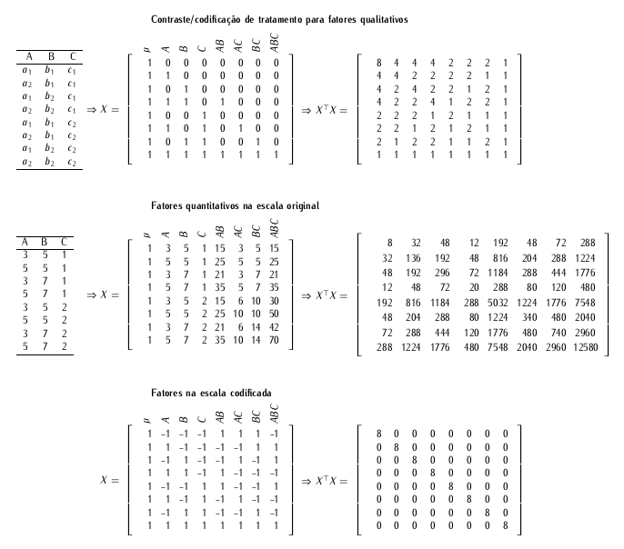

# Experimentos fatoriais 2^k^

## Visão geral

Os experimentos fatoriais $2^k$ são uma categoria especial dos
experimentos fatoriais gerais. Usa-se essa nomenclatura para indicar que
são estudados $k$ fatores, cada um deles com 2 níveis, de forma
completamente cruzada, perfazendo $p$ pontos experimentais.

```{r, engine = 'tikz', echo = FALSE}
\tikzstyle{every picture}+=[remember picture]%
\newcommand{\tm}[1]{\tikz[overlay, anchor = base] \node[red] (#1) {};}%
\begin{tikzpicture}[%
  >=stealth,
  every path/.style = {->, thin, rounded corners},
  bx/.style = {font = \footnotesize, minimum height = 4ex},
  bxl/.append style = {bx, left,  align = flush right},
  bxr/.append style = {bx, right, align = flush left}
]

  \def\hd{0.7}
  \def\vd{0.7}

  \node {$\tm{two}2^{\tm{kk}k} = \tm{pp}p$};

  \draw (two) + (0.5ex, -1.25ex) |- +(-\vd, -\hd) node[bxl] {N{\' u}mero de n{\' iveis}};
  \draw (kk) + (0.5ex, 2.25ex) |- +(\vd, \hd) node[bxr] {N{\' u}mero de fatores};
  \draw (pp) + (0.5ex, -1.25ex) |- +(\vd, -\hd) node[bxr] {N{\' u}mero de pontos experimentais};

  \draw[draw = none] (-5, 0) -- (5, 0);

\end{tikzpicture}%
```

Para estudar o efeito de um fator é preciso que se tenha no mínimos dois
níveis. Dessa forma, o fatorial $2^k$ é o mais econômico tipo de
experimento fatorial. O número de pontos experimentais cresce numa
progressão geométrica de razão 2. O $2^k$ é útil para investigar
simultaneamente vários fatores para posteriormente afunilar a
investigação naqueles que se mostragem mais relevantes. O nome dado para
esse experimento é *screening designs* ou *screening experiments*.

Os experimentos de triagem (*screening*) são feitos nas etapas iniciais
de uma nova investigação quando não se sabe exatamente quais dos $k$
fatores previamente listados influenciam a resposta de um fenômeno. Para
que se possa, portanto, considerar os vários fatores simultaneamente sem
elevar o custo experimental com muitos pontos experimentais, usa-se 2
níveis para cada um dos $k$ fatores.

O fatorial $2^k$ é interessante para

  1. ($2^k$ completo com $r > 1$ repetições) Estudar poucos fatores ($k
     = 2, \ldots, 4$) fazendo $r$ repetições de cada ponto
     experimental. Isso dá um experimento com $r2^k$ corridas ou
     unidades experimentais que, em situações com uniformidade de
     unidades/condições experimentais pode-se fazer em delineamento
     inteiramente casualizado.
  2. ($2^k$ completo com $r = 1$ repetição) Estudar vários fatores ($k
     \geq 4$) com uma única réplica para cada ponto experimental ($r =
     1$) e, ao considerar o efeito interações de alta como nulos, a
     partir delas estimar a variância do erro para testar os efeitos.
  3. ($2^k$ completo em $b = 2^{k - u}$ blocos, $u < k$) Estudar $k$
     fatores com $r \geq 1$ repetições dos pontos experimentais
     fazendo-se a blocagem para acomodar variações das
     unidades/condições experimentais. Se o tamanho do bloco for
     múltiplo de 2 mas menor que $2^k$, ou seja $2^u$ com $u < k$,
     pode-se usar a técnica de confundimento para escolher as corridas
     experimentais que devem ser atribuídas às $u$ unidades
     experimentais de cada bloco. Dessa forma, o experimento terá $r2^k$
     unidades experimentais alocadas em $b = \frac{r2^k}{2^u} = r2^{k -
     u}$ blocos.
  4. (fração de $2^k$ com $2^u$ unidades experimentais, $u < k$) Estudar
     $k$ fatores com apenas $2^u (u < k)$ corridas/unidades
     experimentais. Como não há disponibilidade de recursos para ou
     interesse em estudar todos os $2^k$ pontos experimentais, estuda-se
     uma fração $2^{k - u}$ deles. Todavia, os pontos experimentais
     presentes nessa fração não são uma coleção aleatória qualquer, mas
     sim pontos experimentais devidamente escolhidos para que o
     delineamento apresente boas propriedades.
  5. ($2^k$ com $a > 1$ pontos adicionais) Estudar $k$ fatores
     quantitativos em um esquema de planejamento evolucionário de
     experimento. É a situação que visa determinar a condição de
     operação ótima, ou seja, o conjunto de valores $x_i (i = 1, \ldots,
     k$) no domínio de cada um dos $k$ fatores em que a resposta é
     ótima. Para isso usa delineamentos com pontos experimentais
     adicionais. O mais simples é o que adiciona apenas $a$
     corridas/unidades experimentais no ponto central (centro da região
     experimental).

As 5 situações acima descritas serão estudadas nesse curso.

## Modelo estatístico

Considerando o experimento fatorial $2^k$ completo, o modelo estatístico
que considera todas os termos de interação até a ordem $k$ terá

```{r, engine = 'tikz', echo = FALSE}
\begin{tikzpicture}
\node {
  \begin{minipage}{10cm}

  \begin{tabular}{cl}
  $\binom{k}{1} = k$     & Termos de efeito principal             \\
  $\binom{k}{2}$         & Termos de interações duplas (ordem 2)  \\
  $\vdots$               & $\vdots$                               \\
  $\binom{k}{k - 1}$     & Termos de interações de ordem $k - 1$  \\
  $\binom{k}{k} = 1$     & Termos de interações de ordem $k$      \\ \hline
  $2^k - 1$              & Termos no modelo.
  \end{tabular}

  \end{minipage}
};

\draw[xshift = -1cm, draw = none] (-5, 0) -- (5, 0);

\end{tikzpicture}
```

Por simplicidade de exposição, considere $k = 3$. O modelo estatístico é
$$
\begin{align*}
  y_{ijkr}|ijk &\sim \text{Normal}(\mu_{ijk}, \sigma^2)\\
  \mu_{ijk} &= \mu + A_i + B_j + C_k + (AB)_{ik} + (AC)_{ik} + (BC)_{jk} + (ABC)_{ijk}\\
  \sigma^2 &\propto 1.
\end{align*}
$$

Preferiu-se usar letras romanas no lugar de gregas para indicar o
conjunto de parâmetros de cada termo. Dentro da expressão do modelo $k$
é o subíndice do fator C e não o número de fatores. Para não haver
confusão, entenda que $(AB)$ é a indicação de esse termo acomoda o
efeito do produto cruzado dos fatores A e B e não que seja o produto de
dois números $A$ e $B$.

Se cada ponto experimental tiver $r > 1$ repetições, então tem-se um
estimador puro do erro experimental $\sigma^2$ baseado em $2^k(r - 1)$
graus de liberdade. É muito importante destacar esse aspector. Estimador
puro do erro experimental é aquele proveniente apenas dos desvios das
repetições dentro de cada ponto experimental. Ele não tem "impurezas",
ou melhor, contribuições de termos omitidos do modelo da média
$\mu_{ijk}$. Para experimentos $2^k$ completos com $r = 1$ repetição, o
estimador do erro experimental não será puro mas sim composto por termos
omitidos do modelo da média, no caso, interações de ordem alta.

(ref:anova-eqm-2a3) Esquema do quadro de análise de variância para um
experimento fatorial $2^k$ completo com $r$ repetições.

```{r, engine = 'tikz', echo = FALSE, fig.cap = "(ref:anova-eqm-2a3)"}
\begin{tikzpicture}
\node {
  \begin{minipage}{10cm}

\begin{tabular}{lll}
\hline
Fonte & Graus de liberdade & E(QM)                                      \\ \hline
A     & $1$                & $\sigma^2 + r2^{3 - 1} \sum A_i^2$         \\
B     & $1$                & $\sigma^2 + r2^{3 - 1} \sum B_j^2$         \\
C     & $1$                & $\sigma^2 + r2^{3 - 1} \sum C_k^2$         \\
AB    & $1$                & $\sigma^2 + r2^{3 - 2} \sum (AB)_{ij}^2$   \\
AC    & $1$                & $\sigma^2 + r2^{3 - 2} \sum (AC)_{ik}^2$   \\
BC    & $1$                & $\sigma^2 + r2^{3 - 2} \sum (BC)_{jk}^2$   \\
ABC   & $1$                & $\sigma^2 + r2^{3 - 3} \sum (ABC)_{ijk}^2$ \\
Erro  & $2^3(r - 1)$       & $\sigma^2$                                 \\ \hline
\end{tabular}

  \end{minipage}
};

\draw[xshift = -1cm, draw = none] (-7, 0) -- (7, 0);

\end{tikzpicture}
```

## Nomenclatura alfabética para os pontos experimentais

Para se referir aos pontos experimentais de um experimento $2^k$ usa-se
a nomenclatura alfabética indicada no quadro a seguir. A nomenclatura
posicional incremental também é empregada, porém, mais frequente em
experimentos $3^k$.

(ref:nomenclatura-alfabetica-2a3) Nomenclatura alfabética e posicional
incremental em um experimento fatorial $2^3$.

```{r, engine = 'tikz', echo = FALSE, fig.cap = '(ref:nomenclatura-alfabetica-2a3)'}
\begin{tikzpicture}

% da <- expand.grid(A = c("$a_1$", "$a_2$"),
%                   B = c("$b_1$", "$b_2$"),
%                   C = c("$c_1$", "$c_2$"),
%                   KEEP.OUT.ATTRS = FALSE)
% da <- cbind(data.frame(nom. = c("(1)", "a", "b", "ab",
%                                 "c", "ac", "bc", "abc"),
%                        mod2 = c("000", "100", "010", "110",
%                                 "001", "101", "011", "111")),
%             da)
% da$`nom.` <- sprintf("$%s$", da$`nom.`)
%
% xtable::print.xtable(xtable::xtable(da, digits = 0),
%                      include.rownames = FALSE,
%                      # include.colnames = FALSE,
%                      only.contents = TRUE,
%                      sanitize.text.function = identity,
%                      comment = FALSE,
%                      hline.after = NULL)

\node {
  \begin{minipage}{10cm}

\begin{tabular}{lcccc}
\hline
nom. & pos. & A & B & C \\ \hline
 $(1)$ & 000 & $a_1$ & $b_1$ & $c_1$ \\
  $a$ & 100 & $a_2$ & $b_1$ & $c_1$ \\
  $b$ & 010 & $a_1$ & $b_2$ & $c_1$ \\
  $ab$ & 110 & $a_2$ & $b_2$ & $c_1$ \\
  $c$ & 001 & $a_1$ & $b_1$ & $c_2$ \\
  $ac$ & 101 & $a_2$ & $b_1$ & $c_2$ \\
  $bc$ & 011 & $a_1$ & $b_2$ & $c_2$ \\
  $abc$ & 111 & $a_2$ & $b_2$ & $c_2$ \\ \hline
\end{tabular}

  \end{minipage}
};

\draw[xshift = -3cm, draw = none] (-7, 0) -- (7, 0);

\end{tikzpicture}
```

A nomenclatura indica que o fator aparece no ponto experimental com
nível alto quando a letra do alfabeto minúsculo que o representa estiver
aparecendo. Caso contrário, o fator aparece no nível baixo. Nível alto é
o segundo nível, e.g. $a_2$, nível baixo é o primeiro,
e.g. $a_1$. Quando todos os fatores então no nível baixo, usa-se $(1)$.

A notação posicional incremental é muito simples. Os níveis de um fator
são codificados em $0, \ldots, k - 1$. Para $2^k$, o número 0 indica que
o fator está no nível baixo e o 1 indica que está no nível alto. Essa
notação é útil para construção de delineamentos com confundimento e
fracionamento dos pontos experimentais.

## Codificação para a matriz do modelo

Uma vez espeficado o modelo, existem diferentes opções de codificação
que podem ser usadas conforme o tipo dos fatores: qualitativo ou
quantitativo. No entanto, como o número de níveis de cada fator é 1, o
máximo número de parâmetros necessários para acomodar o efeito de um
fator é 1, seja ele qualitativo ou quantitativo. O que muda é apenas a
interpretação e a possibilidade de fazer predições além dos níveis
estudados dos fatores.

Quando um fator é qualitativo pode-se usar a codificação de
tratamento. Nela, o parâmetro associado ao primeiro nível de cada fator
considerado 0. Os parâmetros tem interpretação de diferença em relação
ao ponto experimental de referência. Essa codificação, embora muito
muito utilizada é subótima no sentido de não gerar uma base ortogonal de
vetores coluna na matriz do modelo. Veja o topo da Figura
\@ref(fig:fatorial-2k-codificacao).

Quando o fator é quantitativo, pode-se definir a matriz do modelo usando
os próprios níveis numéricos, com cada fator sendo representado na sua
própria escala e unidade de medida. Essa representação, embora usada sem
preocupação em problemas de regressão, é subótima porque a matriz
$X^\top X$ é densa. Além disso, a interpretação dos parâmetros e o
erro-padrão associado às estimativas será dependente da escala dos
fatores. Pode-se facilitar a análise do experimento usando um esquema de
codificação apropriado. Veja o meio da Figura
\@ref(fig:fatorial-2k-codificacao).

Para tirar vantagem de benefícios computacionais e de interpretação,
usa-se codificar os níveis dos fatores com $-1$ para o primeiro nível e
$+1$ para o segundo. Essa codificação corresponde ao contraste soma zero
se o fator for qualitativo. Se o fator for quantitativo corresponde à
uma padronização de escala para ter ponto central em 0 e amplitude 1. A
operação de transformação é bem simples
$$
  z = 2 \cdot \frac{x - (x_1 + x_2)/2}{x_2 - x_1}, \quad z \in \{0, 1\},
$$
em que $x$ é o fator na escala original sendo $x_1$ e $x_2$ seus níveis
baixo e alto, respectivamente, e $z$ o fator na escala codificada, com
nível baixo representado por $-1$ e alto por $+1$.

Com a parametrização centrada, tem-se então, i) mais comodidade
computacional pois o produto interno entre colunas da matriz do modelo é
0, gerando uma matriz diagonal fácil de obter a inversa e ii)
interpretação comparativa dos efeitos, ou seja, uma vez que os fatores
estão sob a mesma escala, as estimativas de maior tamanho absoluto
correspondem aos termos de maior efeito e iii) os erros-padrões das
estimativas serão todos de mesmo tamanho, o que decorre da diagonal
homogênea de $X^top X$.

(ref:fatorial-2k-codificacao) Tipos de codificação usadas para
representar o efeito de fatores em experimentos fatoriais $2^k$.

```{r fatorial-2k-codificacao, echo = FALSE, out.width = "100%", fig.cap = '(ref:fatorial-2k-codificacao)'}

```

A codificação soma zero gera uma base ortogonal, com isso as colunas são
ortogonais entre si.

## Representação geométrica

```{r, engine = 'tikz', echo = FALSE}
\begin{tikzpicture}[
  scale = 1, ->, thick, z = {(0.45, 0.35)}, node distance = .65cm,
  vertex/.style = {
    circle, minimum size = 20pt, inner sep = 0pt, fill = gray!10},
  axial/.style={
    rectangle, minimum size = 20pt, inner sep = 0pt, fill = gray!30},
  edge/.style = {draw,thick,-,black},
  rotu/.style = {midway},
  sinal/.style = {draw, circle, inner sep = 0pt, thin}
  ]
  \def\dist{0.4}
  \node[vertex] (v0) at (0, 0, 0) {$(1)$};
  \node[vertex] (v1) at (0, 3, 0) {$b$};
  \node[vertex] (v2) at (3, 0, 0) {$a$};
  \node[vertex] (v3) at (3, 3, 0) {$ab$};
  \node[vertex] (v4) at (0, 0, 3) {$c$};
  \node[vertex] (v5) at (0, 3, 3) {$bc$};
  \node[vertex] (v6) at (3, 0, 3) {$ac$};
  \node[vertex] (v7) at (3, 3, 3) {$abc$};
  \draw[edge] (v0) -- (v1) node[rotu, left = \dist] {$B$} --
    (v3) -- (v2) -- (v0) node[rotu, below = \dist] {$A$};
  \draw[edge] (v0) -- (v4) -- (v5) -- (v1);
  \draw[edge] (v2) -- (v6)
    node[rotu, below right = \dist] {$C$} -- (v7) -- (v3);
  \draw[edge] (v4) -- (v6); \draw[edge] (v5) -- (v7);
  \node[sinal, below of = v0] {$-$};
  \node[sinal, left of = v0] {$-$};
  \node[sinal, left of = v1] {$+$};
  \node[sinal, below of = v2] {$+$};
  \node[sinal, right of = v3] {$-$};
  \node[sinal, right of = v7] {$+$};
  \draw[xshift = 2cm, draw = none] (-5, 0) -- (5, 0);
\end{tikzpicture}%
```

TODO

## Estimação dos efeitos

## Testes de hipótese

## Somas de quadrados
