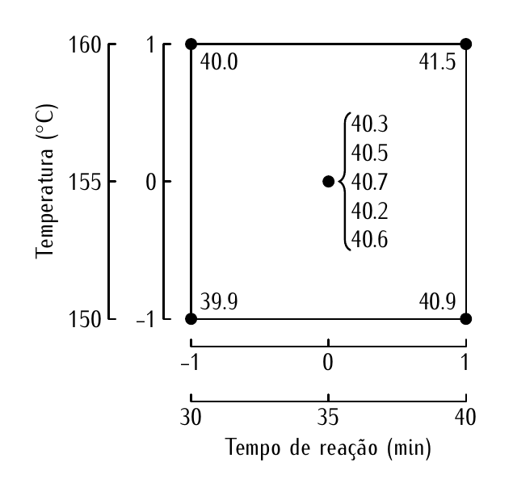
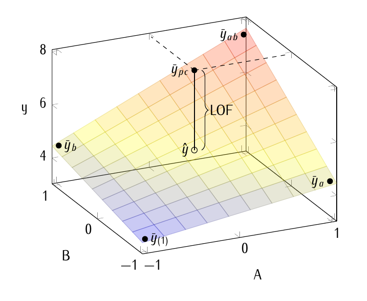
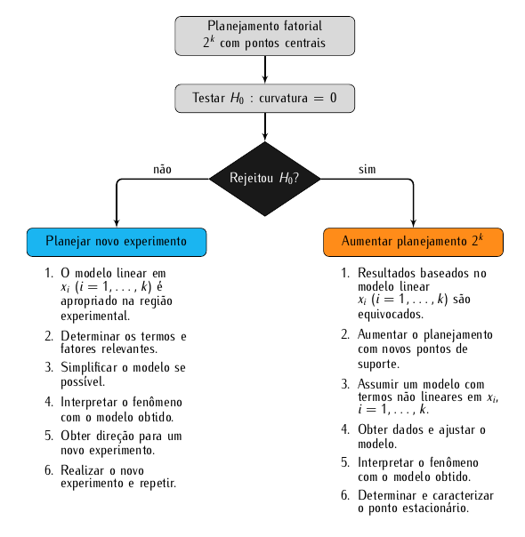

# Fatorial 2^k^ com pontos centrais

## Fundamentação

No capítulos anteriores discutiu-se os experimentos fatoriais $2^k$ com
e repetições e sem repetições dos pontos experimentais. Essencialmente,
a análise desses experimentos baseou-se um modelo na qual o efeito dos
fatores é linear na resposta. Por mais que termos de interação sejam
declarados, ainda assim, o efeito é linear. Ou seja, o efeito de um dado
fator é linear fixando-se o níveis das demais fatores.

No entanto, na prática não tem-se garantia alguma de que a resposta seja
uma função linear dos fatores. A verdadeira função é desconhecida. E o
fato de usar apenas dois níveis para cada fator não permite que modelos
mais complexos sejam ajustados. A preocupação que surge é: se a função
não for linear nessa região experimental, as inferências feitas a partir
do modelo linear que foi assumido são equivocadas. A questão é: como
diagnosticar, sem aumentar o custo do experimento, se a suposição de
linearidade é válida? Além disso, qual as implicações resultantes dessa
hipóptese ser negada? Como o experimentador desse proceder?

No experimento fatorial com replicação tem-se uma estimativa pura do
erro experimental. Mas não há mecanísmos para diagnosticar se a
suposição de linearidade da resposta em relação aos fatores é apropriada
na região experimental estudada. No experimental fatorial sem repetições
não possui-se uma estimativa pura da variância do erro experimental. Uma
estimativa é conseguida com o abandono de termos de maior ordem cujos
efeitos são examinados pelo gráfico quantil quantil normal. No entanto,
pode-se cometer erros ao abandonar termos relevantes. Além do mais,
também não é possível diagnosticar falta de ajuste devido à inadequação
do modelo de efeitos lineares.

A solução para os problemas indicados é muito simples. É adicionar
pontos centrais. Os pontos centrais são corridas experimentais feitas
nas coordenadas 0, ou seja, na origem considerando a escala codificada
dos fatores. As vantagens e desvantagens do emprego de pontos centrais
são discutidas na sequência:
  1. Os pontos centrais permitem obter uma estimativa pura da variância
     residual. Ela é construida a partir dos desvios das repetições em
     relação a média do ponto central, ou seja,
     $$
       \sigma^2_\text{pura} =
         \sum_i^{r_{pc}} (y_{pc(i)} - \bar{y}_{pc})^2/(r_{pc} - 1)
     $$
  2. Eles permitem testar a hipótese nula de curvatura zero ou,
     equivalentemente, indicar a presença de falta de ajuste para o
     modelo de efeitos lineares. Isso quer dizer que, baseado na
     diferença entre o valor predito para o ponto experimental e o valor
     observado, pode-se testar se há desvio da hipótese de relação
     linear da resposta com os fatores dentro da região experimental. É
     um teste baseado em um grau de liberdade.
  3. Não é possível ter pontos centrais em todas os fatores quando algum
     deles é qualitativo já que o ponto 0 representa um nível
     intermediário entre os níveis -1 e 1.
  4. Embora seja possível detectar a presença de curvatura da função,
     apenas com os pontos fatoriais e centrais não é possível ajustar um
     modelo com termos para acomodar a curvatura e predizer a
     resposta. É necessário, portanto, que o delineamento tenha valores
     observados em novos pontos dentro da região experimental.

O modelo considerado para o experimento fatorial $2^k$ com $r_{pc}$
pontos adicionais tem um termo a mais. Usando o fatorial $2^2$, o modelo
é
$$
  \text{E}(y) = \beta_0 + \beta_1 x_1 + \beta_2 x_2 +
    \beta_{12} x_1 x_2 + \delta
$$

em que $\beta_1$ e $\beta_2$ e acomodam o efeito do primeiro e segundo
fatores, $\beta_{12}$ acomoda a interação entre eles e $\delta$ é o
parâmetro que representa a discrepância entre o valor esperado no ponto
central, $f(x_1 = 0, x_2 = 0) = \beta_0$, e o valor esperado da resposta
no ponto central, $\text{E}(y_{pc})$. Portanto, $\delta =
\text{E}(y_{pc}) - \beta_0$.

Para obter uma estimativa do parâmetro de falta de ajuste, precisa-se
apenas criar um variável indicadora que vale 1 quando o ponto é central
e 0 quando o ponto e fatorial. A diferença entre médias amostrais é a
estimativa de $\delta$,
$$
  \hat{\delta} = \bar{y}_{pc} - \bar{y}_{pf}.
$$

A soma de quadrados é dada por
$$
  SQ_\delta = \frac{(r_{pc} \cdot r2^k)
    \cdot \hat{\delta}^2}{r_{pc} + r2^k}.
$$

A hipótese testada com a inclusão do parâmetro $\delta$ é
$$
  H_0: \delta = 0 \Rightarrow \beta_{ii} = 0
    \text{ para todo } i = 1,\ldots, k,
$$
no modelo
$$
  \text{E}(y) = \beta_0 + \sum_i \beta_i x_i +
    \underset{\text{interações duplas}}{
      \sum_{i < j} \beta_{ij} x_i x_j} +
    \underset{\text{curvaturas}}{
      \sum_i \beta_{ii} x_i^2}.
$$
Por simplicidade, indicou-se apenas as interações duplas mas o modelo
deve conter as interações até ordem $k$.

Embora não seja possível ajustar o modelo acima aos dados do experimento
fatorial $2^k$ com pontos centrais, os pontos centrais permitem incluir
o parâmetro $\delta$ testar se a curvatura é nula. A inclusão de pontos
centrais tem baixo custo e fornece o benefício adicional de fornecer uma
estimativa pura da variância residual.

No caso da hipótese não ser rejeitada, procede-se a análise com o modelo
linear no efeito dos fatores. A partir dele, direções para regiões
experimentais mais promissoras podem ser determinadas. No caso da
hipótese ser rejeitada, significa que a presença de curvatura foi
detectada. Isso quer dizer que o ponto estacionário (máximo, mínimo ou
cela) esteja próximo da atual região experimental. Nessa situação, o
atual experimento pode ser enriquecido com pontos de experimentais
adicionais que permitam ajustar um modelo com termos quadráticos, por
exemplo.

(ref:fatorial-ponto-central-2a2) Experimento fatorial $2^2$ com 5 pontos
adicionais. Os valores anotados correspondem a resposta medida em cada
condição experimental. Os dados fazem serão analizados na próxima seção.

```{r fatorial-ponto-central-2a2, echo = FALSE, out.width = "60%", fig.cap = '(ref:fatorial-ponto-central-2a2)'}

```

(ref:factorial-2k-lack-of-fit) Experimento fatorial $2^2$ com ponto
central. A figura ilustra que a discrepância entre a média amostral no
ponto central $\bar{y}_{pc}$ é o valor ajustado no ponto central
$\hat{y}$ indica o tamanho da falta de ajuste (LOF: *lack of fit*).

```{r factorial-2k-lack-of-fit, echo = FALSE, out.width = "75%", fig.cap = '(ref:factorial-2k-lack-of-fit)'}

```

(ref:decision-about-curvature) Ações em relação a rejeição da hipótese
sobre a curvatura na região experimental.

```{r decision-about-curvature, echo = FALSE, out.width = "80%", fig.cap = '(ref:decision-about-curvature)'}

```

```{r, message = FALSE}
library(lattice)
library(tidyverse)
```

## Rendimento de um processo químico

Um engenheiro químico está estudando a conversão percentual ou o
rendimento de um processo. Há duas variáveis de interesse: o tempo e a
temperatura de reação. Pelo fato de não ter certeza em relação à
linearidade da região de exploração, o engenheiro decide conduzir um
planejamento $2^2$ com uma única réplica dos pontos experimentais
aumentado com 5 pontos centrais. O planejamento com os dados de
rendimento são mostrados na Figura
\@ref(fig:fatorial-ponto-central-2a2).

Esses dados são do exemplo 14-6, na página 353 do
@montgomery2009estatistica. Os mesmos estão na página 273, seção 6-6 do
@montgomery2001design.

O fragmento abaixo cria os dados no ambiente R e faz gráficos para
inspeção dos mesmos.

```{r}
# Construção dados dados.
da <- rbind(expand.grid(tem_reac = c(30, 40),
                        temper = c(150, 160),
                        lof = 0,
                        KEEP.OUT.ATTRS = FALSE),
            list(rep(35, 5),
                 rep(155, 5),
                 rep(1, 5)))
da$rend <- c(393, 409, 400, 415,
             406, 402, 407, 405, 403)/10

gg1 <-
ggplot(data = da,
       mapping = aes(x = tem_reac, y = rend, color = factor(temper))) +
    geom_point() +
    stat_summary(mapping = aes(group = 1),
                 color = 1,
                 geom = "line",
                 fun.y = "mean")
gg2 <-
ggplot(data = da,
       mapping = aes(x = temper, y = rend, color = factor(tem_reac))) +
    geom_point() +
    stat_summary(mapping = aes(group = 1),
                 color = 1,
                 geom = "line",
                 fun.y = "mean")
gridExtra::grid.arrange(gg1, gg2, ncol = 1)
```

Os gráficos não fornecem evidências para a rejeição da hipótese de que o
modelo linear nas variáveis é adequado para modelar a média da resposta
nessa região experimental. A média amostral nos pontos centrais é muito
próxima à média predita para o ponto central.

A função `codify()` foi criada para converter para a escala codificada
as os fatores experimentais que estão na escala natural.

```{r}
# Para codificar as variáveis.
codify <- function(x, extremes = range(x)) {
    r <- extremes
    m <- mean(r)
    s <- 0.5 * diff(r)
    (x - m)/s
}
da$A <- codify(da$tem_reac)
da$B <- codify(da$temper)
```

No fragmento abaixo é feito o ajuste do modelo aos dados. A variável
`lof` é uma variável indicadora onde o valor 1 corresponde aos pontos
centrais e o valor 0 aos pontos fatoriais. Dessa forma, o parâmetro
associado a essa variável é interpretado como diferença entre a média
amostral das repetições do ponto central ($\bar{y}_{pc}$) e a média
predita para o ponto central ($\hat{y}_{pc}$). Quando maior essa
diferença, maior é a evidência contra a suposição de curvatura nula, ou,
de forrma equivalente, a suposição de que o modelo linear nos fatores é
adequado.

```{r}
# Ajuste do modelo com pontos centrais.
m0 <- lm(terms(rend ~ A * B + lof, keep.order = TRUE),
         data = da)
anova(m0)
```

O quadro de análise de variância indica, pelos valores do termo `lof`,
não haver evidências de curvatura diferente de 0.

A estimativa pura da variância do erro é, no caso de um experimento com
repetições apenas para o ponto central, a variância amostral das
observações no ponto central. A estimativa do parâmetro associado a
variável `lof`, bem como a corresponde soma de quadrados, é fácil de
obter. O código abaixo faz as contas indicadas.

```{r}
# Estimativa pura da variância do erro.
anova(m0)["Residuals", "Mean Sq"]
s2 <- var(da$rend[da$lof == 1])
s2

# Médias dos pontos fatoriais e centrais.
m <- with(da, tapply(rend, lof, mean))

# Diferença entre as médias é o termo de falta de ajuste.
c(m, diff = unname(diff(m)))
coef(m0)["lof"]

# Soma de quadrados de `lof`.
n <- with(da, tapply(lof, lof, length))
sq_lof <- prod(n) * coef(m0)["lof"]^2/sum(n)
sq_lof

# Estatística F do quadro de anova.
sq_lof/s2
```

## Fabricação de semicondutores

A planilha eletrônica com os dados usados em @montgomery2012design está
disponível para download no endereço
<http://bcs.wiley.com/he-bcs/Books?action=resource&bcsId=7009&itemId=1118146921&resourceId=26715&chapterId=75851>. Os
dados no fragmento de código abaixo estão na guia "Chapter 06" com nome
"Problem 23" pois correspondem ao exercício 6-23.

Os processos de fabricação de semicondutores têm fluxos de montagem
longos e complexos. Portanto, marcas de matriz e leitores automatizados
de matriz 2D são usados ​​em várias etapas do processo nas
fábricas. Marcas de matriz ilegíveis afetam negativamente as taxas de
operação de fábrica porque é necessária a entrada manual de dados da
peça antes que a fabricação possa retomar. Um experimento fatorial $2^4$
foi conduzido para desenvolver uma marca de laser de matriz 2D em uma
cobertura de metal que protege uma matriz montada em substrato. Os
fatores de design são potência do laser (A: 9 e 13 W), frequência de
pulso do laser (B: 4000 e 12000 Hz), tamanho da célula da matriz (C:
0,07 e 0,12 polegadas) e velocidade de gravação (D: 10 e 20
polegadas/segundo). A variável de resposta é a correção de erro não
utilizada (UEC). O experimento teve ainda a adição de pontos centrais
para compor uma estimativa pura do erro experimental e permitir
diagnosticar falta de ajuste. Um UEC de 0 representa a leitura mais
baixa que ainda resulta em uma matriz decodificável, enquanto um valor
de 1 é a leitura mais alta.

O fragmento abaixo cria o objeto no R com os dados do
experimento. Gráficos são feitos para inspeção dos dados.

```{r}
txt <- "Laser Power	Pulse Frequency	Cell Size	Writing Speed	UEC
-1	-1	-1	-1	0,75
1	-1	-1	-1	0,98
-1	1	-1	-1	0,72
1	1	-1	-1	0,98
-1	-1	1	-1	0,63
1	-1	1	-1	0,67
-1	1	1	-1	0,65
1	1	1	-1	0,8
-1	-1	-1	1	0,6
1	-1	-1	1	0,81
-1	1	-1	1	0,63
1	1	-1	1	0,79
-1	-1	1	1	0,56
1	-1	1	1	0,65
-1	1	1	1	0,55
1	1	1	1	0,69
0	0	0	0	0,98
0	0	0	0	0,95
0	0	0	0	0,93
0	0	0	0	0,96"

da <- read.table(textConnection(txt),
                 header = TRUE, sep = "\t", dec = ",")
str(da)

da %>%
    gather("fator", "valor", 1:4) %>%
    ggplot(mapping = aes(x = valor, y = UEC)) +
    facet_wrap(facets = ~fator) +
    geom_point() +
    stat_summary(mapping = aes(group = 1),
                 color = 1,
                 geom = "line",
                 fun.y = "mean")

names(da) <- c(LETTERS[1:4], "y")
da$lof <- as.integer(da$A == 0)
```

Os gráficos fornecem evidência de que a hipótese de curvatura nula seja
falsa. A média amostral no ponto central não encontra-se na posição
correspondente a um efeito linear dos fatores na resposta, ou seja, no
ponto médio entre as médias marginais dos pontos fatoriais.

O código abaixo declara o modelo e exibe o quadro de análise de
variância.

```{r}
# Ajuste do modelo com pontos centrais.
m0 <- lm(y ~ A * B * C * D + lof,
         data = da)
anova(m0)
```

Pelo quadro de análise de variância verifica-se que a hipótese de
curvatura nula é rejeitada (à 1%). Dessa forma, suspeita-se que o ótimo
da resposta esteja próximo, ou talvez dentro, da região experimental. O
delineamento pode ser aumentado com pontos experimentais em novas
coordenadas para que um modelo com termos quadráticos seja ajustadado
aos dados. É comum aumentar do delineamento $2^k$ para $3^k$ ou usar o
delineamento composto central. Estes serão vistos nos próximos
capítulos.

Os códigos a seguir explicitam os cálculos para obter a estimativa pura
da variância do erro, a estimativa do parâmetro de falta de ajuste e a
soma de quadrados correspondente.

```{r}
# Estimativa pura da variância do erro.
anova(m0)["Residuals", "Mean Sq"]
s2 <- var(da$y[da$lof == 1])
s2

# Médias dos pontos fatoriais e centrais.
m <- with(da, tapply(y, lof, mean))

# Diferença entre as médias é o termo de falta de ajuste.
c(m, diff = unname(diff(m)))
coef(m0)["lof"]

# Soma de quadrados de `lof`.
n <- with(da, tapply(lof, lof, length))
sq_lof <- prod(n) * coef(m0)["lof"]^2/sum(n)
sq_lof

# Estatística F do quadro de anova.
sq_lof/s2
```

## Taxa de filtragem

Um produto químico é produzido em um vaso de pressão. Um experimento
fatorial é realizado na planta piloto para estudar os fatores que podem
influenciar a taxa de filtração deste produto. Os quatro fatores são
temperatura (A), pressão (B), concentração de formaldeído (C) e taxa de
agitação (D). Cada fator está presente em dois níveis. O engenheiro do
processo está interessado em maximizar a taxa de filtragem.

A planilha eletrônica com os dados usados em @montgomery2012design está
disponível para download no endereço
<http://bcs.wiley.com/he-bcs/Books?action=resource&bcsId=7009&itemId=1118146921&resourceId=26715&chapterId=75851>. Os
dados no fragmento de código abaixo estão na guia "Chapter 06" com nome
"Problem 23". Eles correspondem ao exercício 6-33 que usam os dados do
exemplo 6.2.

Dataset disponível em
<https://gitlab.c3sl.ufpr.br/walmes/ce074/blob/master/scripts/book_example_hw_dataset.xlsx>,
aba "Chapter 06" com nome "Problem 33".

O código abaixo cria o objeto com os dados no ambiente R e constrói
gráficos para exame dos mesmos.

```{r}
txt <- "Temperature	Pressure	Concentration	Stirring Rate	Filtration Rate
-1	-1	-1	-1	45
1	-1	-1	-1	71
-1	1	-1	-1	48
1	1	-1	-1	65
-1	-1	1	-1	68
1	-1	1	-1	60
-1	1	1	-1	80
1	1	1	-1	65
-1	-1	-1	1	43
1	-1	-1	1	100
-1	1	-1	1	45
1	1	-1	1	104
-1	-1	1	1	75
1	-1	1	1	86
-1	1	1	1	70
1	1	1	1	96
0	0	0	0	73
0	0	0	0	75
0	0	0	0	71
0	0	0	0	69
0	0	0	0	76"

da <- read.table(textConnection(txt),
                 header = TRUE, sep = "\t", dec = ",")
str(da)

da %>%
    gather("fator", "valor", 1:4) %>%
    ggplot(mapping = aes(x = valor, y = Filtration.Rate)) +
    facet_wrap(facets = ~fator) +
    geom_point() +
    stat_summary(mapping = aes(group = 1),
                 color = 1,
                 geom = "line",
                 fun.y = "mean")

names(da) <- c(LETTERS[1:4], "y")
da$lof <- as.integer(da$A == 0)
```

A avaliação dos gráficos indica haver pouca evidência para a rejeuitar a
hipótese nula de curvatura zero. Portanto, ao que parece, o efeito dos
fatores é linear na resposta na atual região experimental.

O código abaixo declara o modelo, estima os efeitos e exibe o quadro de
análise de variância.

```{r}
# Ajuste do modelo com pontos centrais.
m0 <- lm(y ~ A * B * C * D + lof,
         data = da)
anova(m0)
```

Pela estatística F do quadro de análise de variância, não evidências
para rejeitar a hipótese de que a curvatura é zero, ou seja, não
rejeita-se a hipótese de que o modelo linear no efeito dos fatores é
adequado na atual região experimental.

Os códigos a seguir explicitam os cálculos para obter a estimativa pura
da variância do erro, a estimativa do parâmetro de falta de ajuste e a
soma de quadrados correspondente.

```{r}
# Estimativa pura da variância do erro.
anova(m0)["Residuals", "Mean Sq"]
s2 <- var(da$y[da$lof == 1])
s2

# Médias dos pontos fatoriais e centrais.
m <- with(da, tapply(y, lof, mean))

# Diferença entre as médias é o termo de falta de ajuste.
c(m, diff = unname(diff(m)))
coef(m0)["lof"]

# Soma de quadrados de `lof`.
n <- with(da, tapply(lof, lof, length))
sq_lof <- prod(n) * coef(m0)["lof"]^2/sum(n)
sq_lof

# Estatística F do quadro de anova.
sq_lof/s2
```

Pelo exame completo do quadro de anova, verifica-se que o modelo poder
ser simplificado. Sendo conservador, o modelo pode contemplar apenas as
interações duplas AC e AD, não havendo razão forte para menter o fator
B. Dessa forma, o código abaixo contém o modelo reduzido indicado.

```{r}
# Simplifica o modelo.
m1 <- update(m0, . ~ A * (C + D))
anova(m1)

# Comparação entre modelos encaixados.
anova(m0, m1)
```

Para detalhar o efeito dos fatores na resposta, serão feitos
gráficos. Por haver mais sentido prático, será estudado o fator A
(temperatura) e C (concentração) fixando níveis de D (taxa de agitação).

```{r}
# Malha fina de valores para predição.
pred <- expand.grid(A = seq(-1, 1, by = 0.1),
                    C = seq(-1, 1, by = 0.1),
                    D = seq(-1, 1, by = 0.5),
                    KEEP.OUT.ATTRS = FALSE)
pred <- cbind(pred,
              as.data.frame(predict(m1,
                                    newdata = pred,
                                    se.fit = TRUE)[1:2]))

# Gráfico da superfície média (valores ajustados).
ggplot(data = pred,
       mapping = aes(x = A, y = C, z = fit, fill = fit)) +
    facet_wrap(facets = ~D) +
    geom_tile() +
    scale_fill_distiller(palette = "Spectral",
                         direction = 1) +
    geom_contour(color = "black") +
    coord_equal()

```

A função apresenta um comportamento que, conforme antecipado, indica que
o efeito de A depende do valor de C e vice versa. É possível entender
melhor com gráfico de linhas.

```{r}
# Gráficos de linhas.
ggplot(data = pred,
       mapping = aes(x = A, y = fit, color = C, group = C)) +
    facet_wrap(facets = ~D) +
    geom_line() +
    scale_color_distiller(palette = "PRGn")
```

No fragmento a seguir são feitos gráficos de superfície para dar uma
perspectiva diferente sobre a relação entre as variáveis.

```{r}
# Esquema de cores para o gráfico com a `lattice`.
colr <- RColorBrewer::brewer.pal(11, "Spectral")
colr <- colorRampPalette(colr, space = "rgb")

# Adicionando os contornos sobre a superfície. Requer funções externas.
source(paste0("https://raw.githubusercontent.com/walmes/wzRfun/",
              "master/R/panel.3d.contour.R"))

# Gráfico de superfície em 3D com isolinhas (ainda não recomendo).
wireframe(fit ~ A + C | factor(D),
          data = pred,
          as.table = TRUE,
          drape = TRUE,
          col = rgb(0, 0, 0, 0.25),
          panel.3d.wireframe = panel.3d.contour,
          col.contour = 1,
          type = "on",
          col.regions = colr(100))

# Valores preditos em cada ponto experimental.
grid <- unique(da[, c("A", "C", "D")])
grid$fit <- predict(m1, newdata = grid)
arrange(grid, fit)
```


## Exercícios

### Problema 37

A planilha eletrônica com os dados usados em @montgomery2012design está
disponível para download no endereço
<http://bcs.wiley.com/he-bcs/Books?action=resource&bcsId=7009&itemId=1118146921&resourceId=26715&chapterId=75851>. Os
dados no fragmento de código abaixo estão na guia "Chapter 06" com nome
"Problem 37" pois correspondem ao exercício 6-37, página 301.

A resistividade em uma pastilha de silício é influenciada por vários
fatores. Os resultados de uma experimento fatorial $2^4$ realizada
durante uma etapa crítica do processamento são mostrados na criada no
bloco de código a seguir.

1. Especifique e ajuste o modelo aos dados. Que conclusões podem
   ser tiradas sobre a curvatura?
1. Estime os efeitos dos fatores. Plote as estimativas de efeito em um
   gráfico de probabilidade normal e selecione um modelo experimental.
2. Analise os resíduos. Existe alguma indicação de inadequação do
   modelo?
3. Repita a análise das partes anteriores usando ln(y) como a variável
   de resposta. Há alguma indicação de que a transformação tenha sido
   útil?

```{r, eval = FALSE}
txt <- "A	B	C	D	Resistivity
-1	-1	-1	-1	1,92
1	-1	-1	-1	11,28
-1	1	-1	-1	1,09
1	1	-1	-1	5,75
-1	-1	1	-1	2,13
1	-1	1	-1	9,53
-1	1	1	-1	1,03
1	1	1	-1	5,35
-1	-1	-1	1	1,6
1	-1	-1	1	11,73
-1	1	-1	1	1,16
1	1	-1	1	4,68
-1	-1	1	1	2,16
1	-1	1	1	9,11
-1	1	1	1	1,07
1	1	1	1	5,3
0	0	0	0	8,15
0	0	0	0	7,63
0	0	0	0	8,95
0	0	0	0	6,48"

da <- read.table(textConnection(txt),
                 header = TRUE, sep = "\t", dec = ",")
str(da)
```

### Problema 41

A planilha eletrônica com os dados usados em @montgomery2012design está
disponível para download no endereço
<http://bcs.wiley.com/he-bcs/Books?action=resource&bcsId=7009&itemId=1118146921&resourceId=26715&chapterId=75851>. Os
dados no fragmento de código abaixo estão na guia "Chapter 06" com nome
"Problem 41" pois correspondem ao exercício 6-41, página 302.

Um artigo do *Journal of Chemical Technology and Biotechnology*
(Response Surface Optimization of the Critical Media Components for the
Production of Surfactin, 1997, Vol. 68, pp. 263–270) descreve o uso de
um experimento projetado para maximizar a produção de surfactina. Uma
parte dos dados desta experiência é mostrada no fragmento de código a
seguir. A surfactina foi testada por um método indireto, que envolve a
medição das tensões superficiais das amostras de caldo diluído. As
concentrações relativas de surfactina foram determinadas diluindo em
série o caldo até que a concentração crítica de micelas (CMC) fosse
atingida. A diluição na qual a tensão superficial começa a subir
abruptamente foi indicada pelo CMC^-1^ e foi considerada proporcional à
quantidade de surfactante presente na amostra original.

  1. Analise os dados deste experimento. Identifique os fatores e
     interações significativos.
  2. Existe alguma indicação de curvatura na função de resposta? São
     necessárias experimentos adicionais? O que você recomendaria fazer
     agora?
  3. Analise os resíduos desse experimento. Existem indícios de
     inadequação do modelo ou violações das premissas?
  4. Quais condições otimizariam a produção de surfactina?

```{r, eval = FALSE}
txt <- "Glucose	NH4NO3	FeSO4	MnSO4	y
20	2	6	4	23
60	2	6	4	15
20	6	6	4	16
60	6	6	4	18
20	2	30	4	25
60	2	30	4	16
20	6	30	4	17
60	6	30	4	26
20	2	6	20	28
60	2	6	20	16
20	6	6	20	18
60	6	6	20	21
20	2	30	20	36
60	2	30	20	24
20	6	30	20	33
60	6	30	20	34
40	4	18	12	35
40	4	18	12	35
40	4	18	12	35
40	4	18	12	36
40	4	18	12	36
40	4	18	12	34"

da <- read.table(textConnection(txt),
                 header = TRUE, sep = "\t", dec = ",",
                 check.names = FALSE)
str(da)
```
