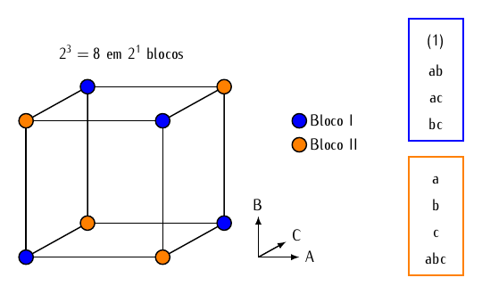
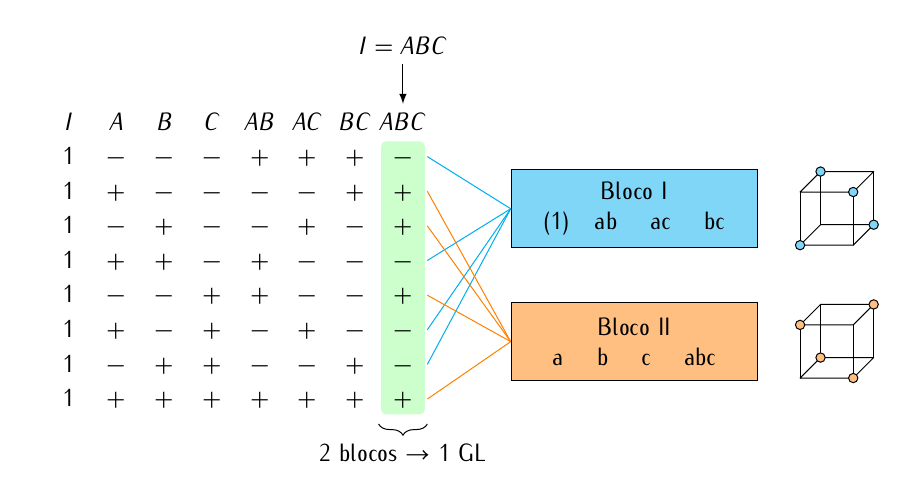
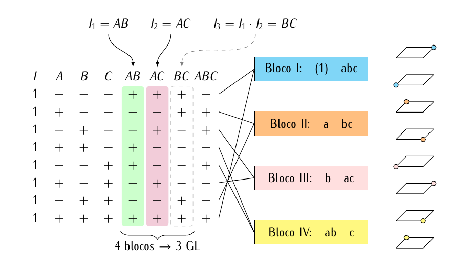

# Confundimento para blocagem em fatoriais 2^k^

## Fundamentação

Existem certas situações em que é praticamente impossível fazer todas as
corridas de um experimento em condições uniformes. Por exemplo, pode
haver limitações da quantidade de matéria prima, ou matéria prima de
diversas origens. As condições de contorno podem mudar ao longo do
ensaio (temperatura, ventilação, luz). Pode existir um número elevado de
tratamentos difícil de acomodar em um curto espaço de tempo/espaço ou
reduzído número de instrumentos/operadores, além de ser desejável variar
as condições de contorno para garantir eficiência/robustez aos
resultados. A técnica experimental adotada nessas situações é a
blocagem.

A blocagem é um recursos para garantir controle local. A idéia central
da blocagem é fazer com que as unidades experimentais (UEs) sejam
homogêneas dentro dos blocos. Os blocos são **completos** quando em cada
bloco existe pelo menos uma UE de cada ponto experimental, e
**incompleto** caso contrário.

Nos experimentos $2^k$ existe uma série de opções de blocagem. A
primeira é repetir o experimento de forma que cada repetição completa
(que inclui todos os pontos experimentais) seja um bloco. É o caso comum
quando tem-se poucos tratamentos (geralmente $2^2$ ou $2^3$), e nesses
casos específicos temos um fatorial com **blocos completos**.

Como nos experimentos fatorias $2^k$ ($k \geq 3$) o número de pontos
experimentais geralmente é grande, devido ao caráter exploratório do
experimento, os blocos dificilmente cumprirão seu papel se forem
completos, por isso geralmente adota-se **blocos incompletos**. Nesse
caso os tratamentos devem ser particionados e atribuídos aos
blocos. Nada impede que essa partição dos tratamentos seja aleatória,
porém quando feita estrategicamente leva-se algumas vantagens.

A estratégia adotada para se atribuir os tratamentos aos blocos é a de
**confundimento**. A idéia central é tomar interações de alta ordem,
pois tem menor contribuição pelo princípio da esparsidade, e
propositalmente confundir o efeito dessa interação com o efeito dos
blocos. Isso porque interações de ordem alta dificilmente são
interpretáveis, e o efeito puro dos blocos não é do interesse do
pesquisador. O bloco está presente para acomodar alterações das
condições de contorno. Dessa forma, não é desconforto ter esses efeitos
confundidos/misturados quando o foco do experimento são os efeitos
principais e interações de ordem mais baixa.

Vamos considerar a construção e análise de fatoriais $2^k$ em $2^p$
blocos incompletos, onde $p < k$. Consequentemente, estes experimentos
podem ser divididos em 2, 4, 8, $\ldots$ blocos.

(ref:cubos-fatoriais-confundimento-2a3-em-2-blocos) Representação
geométrica da blocagem feita em um fatorial $2^3$ para alocação dos
pontos experimentais em 2 blocos usando a interação ABC para o
confundimento.

```{r cubos-fatoriais-confundimento-2a3-em-2-blocos, echo = FALSE, out.width = "75%", fig.cap = '(ref:cubos-fatoriais-confundimento-2a3-em-2-blocos)'}

```

(ref:fatorial-2a3-confundimento-abc) Ilustração da alocação dos pontos
experimentais de um planejamento fatorial $2^3$ em 2 blocos usando para
o confundimento com os blocos a interação tripla, ou seja, com o
contraste de definição $I = ABC$.

```{r fatorial-2a3-confundimento-abc, echo = FALSE, out.width = "75%", fig.cap = '(ref:fatorial-2a3-confundimento-abc)'}

```

(ref:fatorial-2a3-confundimento-ab-ac) Ilustração da alocação dos pontos
experimentais de um planejamento fatorial $2^3$ em 4 blocos usando para
o confundimento com os blocos duas interações duplas, no caso, com os
contrastes de definição $I_1 = AB$ e $I_2 = AC$.

```{r fatorial-2a3-confundimento-ab-ac, echo = FALSE, out.width = "75%", fig.cap = '(ref:fatorial-2a3-confundimento-ab-ac)'}

```

TODO a análise do experimento com blocos completos...

TODO tabela de sinais ...

O método mais geral para construir os blocos é através dos **contrastes
de definição**. Esse método é usar para os experimentos fatoriais $3^k$
também.  Este método usa uma combinção linear
$$
  L = \alpha_1  x_1 + \alpha_2  x_2 + \cdots + \alpha_k  x_k,
$$

em que $x_i$ é o nível do $i$-ésimo fator aparecendo em um ponto
experimental dos $2^k$ existentes. Nesse contraste, $x$ está codificado
como 0 e 1, para baixo e alto, respectivamente, diferente do tradicional
-1 e 1. O coeficiente $\alpha_i \in \{0, 1\}$ é o expoente aparecendo no
$i$-ésimo fator no efeito que deve ser confundido.

Por exemplo, se o efeito a ser confundido for ABCD, então os valores de
$\alpha_i$ serão todos iguais a 1, pois $ABCD = A^1 B^1 C^1 D^1$. Se o
efeito a ser confundido for ACD, então os valores serão $\alpha_1 =
\alpha_3 = \alpha_4 = 1$, e $\alpha_2 = 0$, pois $ACD = A^1 B^0 C^1
D^1$.

Dessa forma, para o sistema $2^k$, temos tanto $\alpha_i = 0$ ou $1$, e
$x_i = 0$ (nível baixo) ou $1$ (nível alto). Pontos experimentais que
tenham o mesmo valor de $L \mod 2$ pertencerão ao mesmo bloco. A função
$x \mod 2$ retorna o resto da divisão de $x$ por 2. Como os únicos
valores possíveis de $L \mod 2$ são 0 e 1, isso atribuirá os $2^k$
pontos experimentais à exatamente dois blocos.

Como exemplo, considere um planejamento $2^3$, com a interação ABC (a de
ordem mais alta) confundida com bloco. Aqui, $x_1$ corresponde a A,
$x_2$ a B, e $x_3$ a C. Portanto, tem-se que $\alpha_1 = \alpha_2 =
\alpha_3 = 1$, pois como o fator a ser confundido é ABC, então o
expoente destes três fatores é 1. Portanto, o contraste de definição
utilizado para confundir ABC com blocos é
$$
  L = x_1 + x_2 + x_3.
$$

Com a finalidade de atribuir os pontos experimentais aos dois blocos,
determina-se o valor de $L \mod 2$ para cada ponto experimental:
$$
\begin{align}
  (1):& \quad L = 1(0) + 1(0) + 1(0) = 0 \mod 2 = 0 \\
  a:& \quad L = 1(1) + 1(0) + 1(0) = 1 \mod 2 = 1 \\
  b:& \quad L = 1(0) + 1(1) + 1(0) = 1 \mod 2 = 1 \\
  ab:& \quad L = 1(1) + 1(1) + 1(0) = 2 \mod 2 = 0 \\
  c:& \quad L = 1(0) + 1(0) + 1(1) = 1 \mod 2 = 1 \\
  ac:& \quad L = 1(1) + 1(0) + 1(1) = 2 \mod 2 = 0 \\
  bc:& \quad L = 1(0) + 1(1) + 1(1) = 2 \mod 2 = 0 \\
  abc:& \quad L = 1(1) + 1(1) + 1(1) = 3 \mod 2 = 1
\end{align}
$$

Dessa forma, as combinações `(1)`, `ab`, `ac`, e `bc` são corridas no
bloco I, enquanto que `a`, `b`, `c`, e `abc` são corridas no
bloco 2. Veja que esta atribuição é idêntica àquela realizada ao se
utilizar a coluna ABC da tabela de sinais. **O contraste de definição é
apenas uma generalização** daquele método.

## TODO FIXME

```{r, message = FALSE}
library(tidyverse)
```

```{r}
# Criando um experimento 2^4 em dois blocos usando I = ABCD.
k <- 4
da <- do.call(expand.grid,
              setNames(replicate(k, c(-1, 1), simplify = FALSE),
                       LETTERS[1:k]))

# Cria os blocos usando I = ABCD.
da$blc <- with(da,
               factor(A * B * C * D, labels = c("II", "I")))

# Ordena para ficar com a mesma disposição do livro.
da <- da[with(da, order(blc)), ]
da

# Adiciona o vetor da resposta.
da$y <- c(71, 48, 68, 65, 43, 104, 86, 70,
          25, 45, 40, 60, 80, 25, 55, 76)

# Ajuste do modelo saturado.
m0 <- lm(y ~ blc + A * B * C * D, data = da)

# O efeito `A:B:C:D` não foi estimado pois tem um `NA` no lugar.
coef(m0)

# Cria um tabela com nomes e valores das estimativas.
cfs <- coef(m0)[-(1:2)] %>%
    na.omit() %>%
    enframe()

# Gráfico quantil-quantil normal das estimativas.
qq <- qqnorm(cfs$value, pch = 19, col = "orange")
text(x = qq$x,
     y = qq$y,
     labels = cfs$name,
     pos = ifelse(qq$x < 0, 4, 2))

# Modelo reduzido.
m1 <- lm(y ~ blc + A * (C + D), data = da)
anova(m1)

#
```
